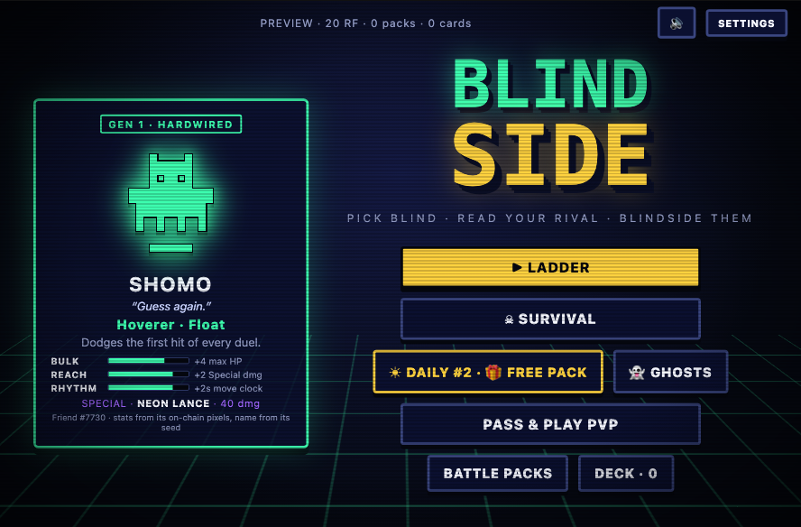
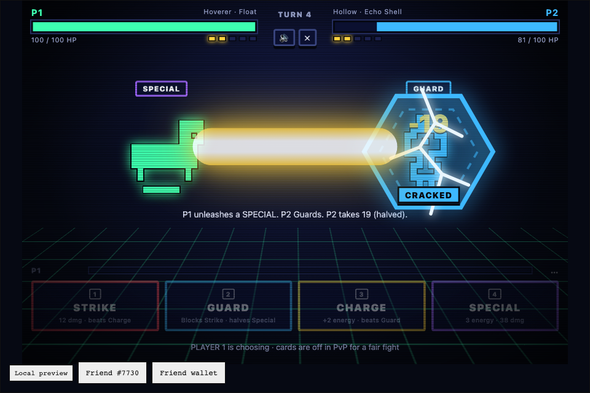
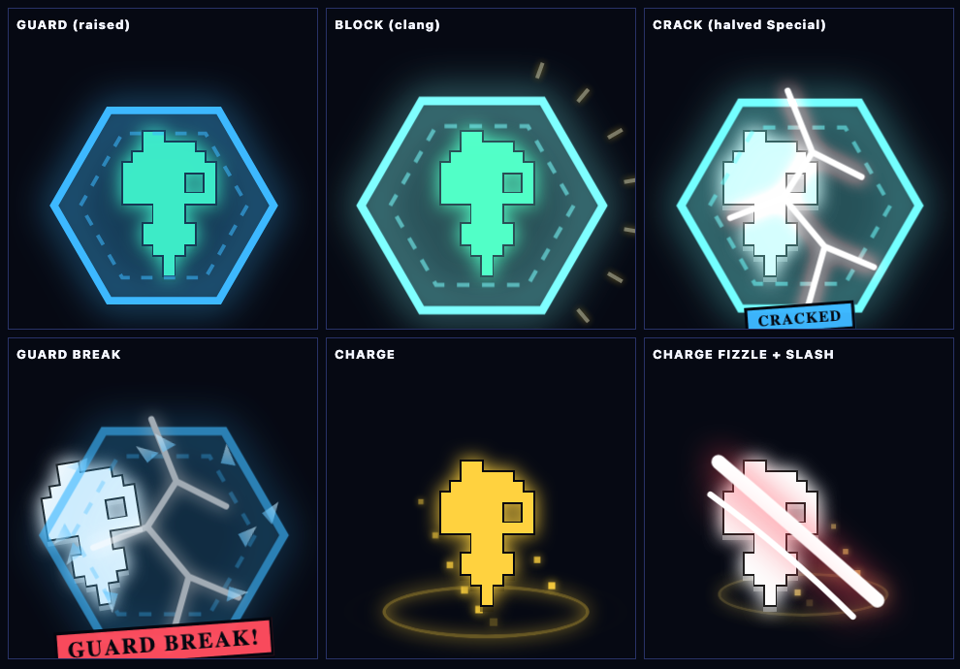
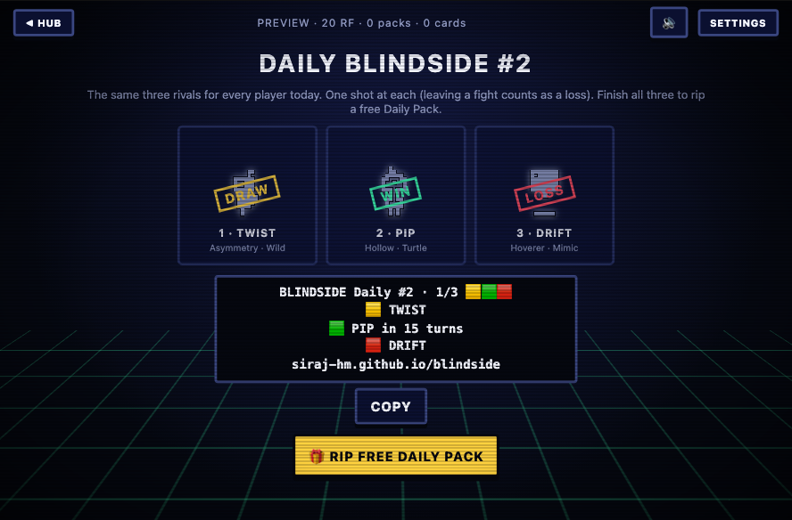
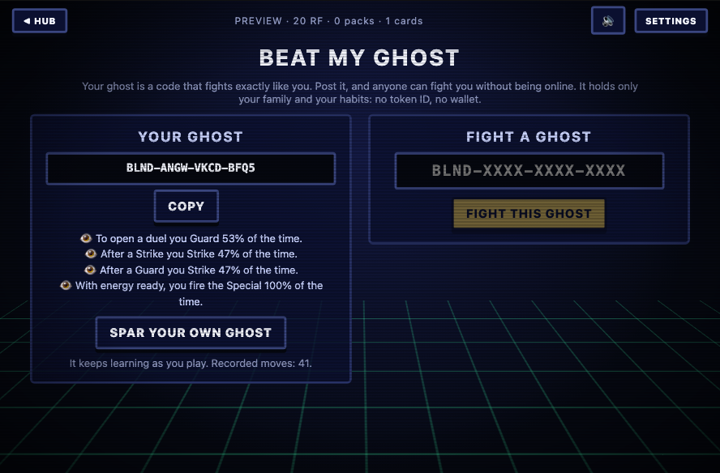
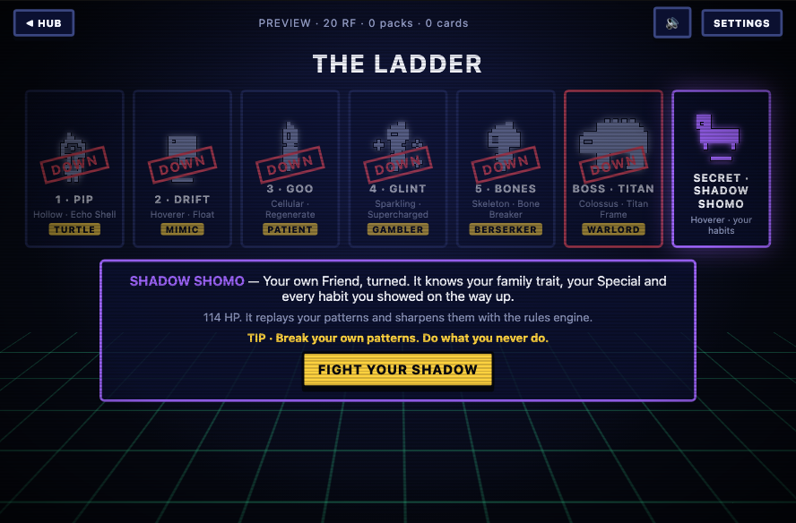
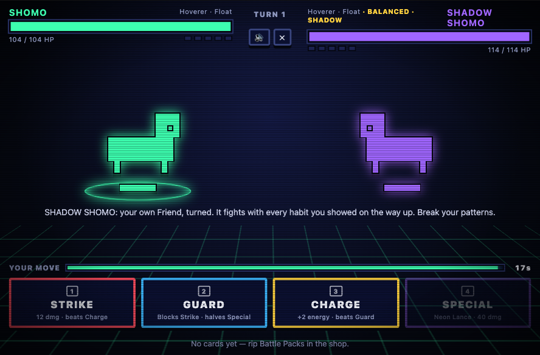
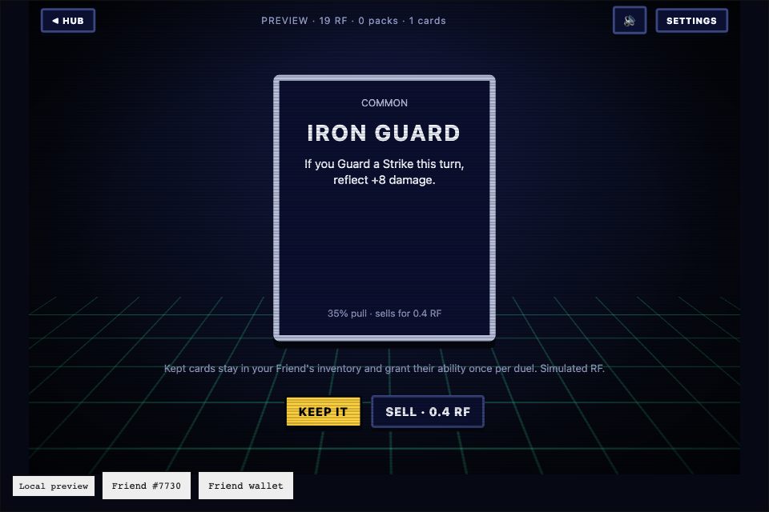
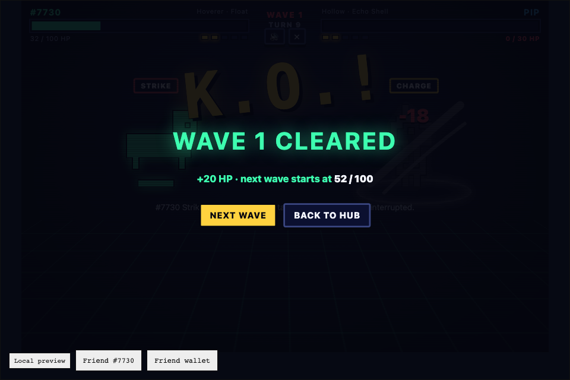

# BLINDSIDE: pick blind, read your rival, blindside them

A turn-based Rare Friends **mind-game fighter**: your own Generations NFT battles with **simultaneous hidden moves**. Its seed, pixels, generation and family make it a fighter unlike any other Friend, you can post a **ghost** of your playstyle for anyone to fight, and ability cards come from simulated-RF Battle Packs.

**Builder:** Siraj · X [@sirajsoft](https://x.com/sirajsoft) · **Category:** Character Spotlight (also Economy Potential) · **SDK:** FriendSDK v0.1.3

- **▶ Playable preview:** https://siraj-hm.github.io/blindside/
- **🎬 Trailers:** [16:9](https://github.com/Siraj-HM/blindside/releases/download/vibeathon-v1/blindside-trailer.mp4) · [9:16](https://github.com/Siraj-HM/blindside/releases/download/vibeathon-v1/blindside-trailer-x-portrait.mp4)
- **Source:** [Siraj-HM/blindside · games/blindside](https://github.com/Siraj-HM/blindside/tree/c1151091914862c9303790ea92edfec94d6b6f9d/games/blindside) · [Game rules (game.json)](https://github.com/Siraj-HM/blindside/blob/c1151091914862c9303790ea92edfec94d6b6f9d/games/blindside/game.json)
- **Requirements:** a browser wallet on **Robinhood mainnet (4663)** holding a hardwired Rare Friends Generations NFT (**generation ≥ 1**). The SDK runtime connects the wallet and verifies ownership; play needs no RF funding, approval or transaction signature.



## What makes it different

- **Simultaneous hidden moves.** Both fighters lock in blind and reveal together. Energy is public; moves are not. Every turn is a read.
- **A counter triangle with a resource.** Guard beats Strike, Charge beats Guard, Strike beats Charge, and Charge builds the energy for a 38-damage Special.
- **Rivals with personalities.** Each ladder rival plays a distinct style with a readable weakness: PIP the Turtle hides behind Guard, DRIFT the Mimic copies you, GOO the Patient punishes greed, GLINT the Gambler hoards energy, BONES the Berserker never blocks, and TITAN the Warlord quakes through your guard.
- **An AI that learns you.** Later rivals track your recent habits and simulate every response through the real rules engine to counter them.
- **Your Friend fights like itself.** Its registry seed names it and gives it a catchphrase and a named Special ("Neon Lance"); its canonical pixels set three small stats (BULK, REACH, RHYTHM); its generation sets a rank and aura; its family grants one of nine traits. Deterministic: the same Friend is always the same fighter.
- **Beat My Ghost: PvP between strangers without a server.** Your habits compress into a 12-character code (`BLND-ANEM-JNR5-9FXZ`). Post it and anyone can fight an AI that plays exactly like you. The code holds only a family and move frequencies, never a token ID or wallet.
- **Your own Friend is the final boss.** Beat TITAN and a secret SHADOW of your Friend appears, playing every habit you showed on the way up. To win, you have to break your own patterns.
- **Daily Blindside:** the same three rivals for every player each day, one shot each, a Wordle-style result to share, and a free Daily Pack for finishing.
- **Pass & play PvP** on one device and a **Survival** mode where HP carries between waves.

## Run it

Node.js 22+, from the source repository (a FriendSDK v0.1.3 fork):

```sh
git clone https://github.com/Siraj-HM/blindside.git
cd blindside
git checkout c1151091914862c9303790ea92edfec94d6b6f9d
npm ci
npm run build
npm run dev:game -- games/blindside
```

Open the printed URL (normally `http://localhost:4173`), connect your wallet and choose your Friend.

## Play

Click or tap, or use keys `1–4` for moves, `Q W E R T` to arm a card, `P` to peek and `Enter` to continue. You have **15 seconds** per pick; time out and your Friend hesitates into a Guard. Mute and reduced motion are in the HUD and Settings.

| Move | Cost | Effect |
|---|---|---|
| **Strike** | free | 12 damage. Hitting a Charge deals 18 and cancels its energy. |
| **Guard** | free | Blocks a Strike (attacker takes 4 recoil) and halves a Special. |
| **Charge** | free | +2 energy, or +3 if the rival Guards. A landed hit cancels it. |
| **Special** | 3 energy | 38 damage. |

100 HP, max 5 energy, 30-turn limit; a double KO is a draw. Health turns red at 25% (CRITICAL).



### Your Friend fights like itself

| From its on-chain… | You get |
|---|---|
| **Seed** (`seedOf`) | A nickname, a victory catchphrase and a named Special |
| **Pixels** (canonical 16×16 art) | **BULK** (lit pixels): +1–6 max HP · **REACH** (body width): +0–3 Special damage · **RHYTHM** (idle-animation movement): +0–2 s on the move clock |
| **Generation** | A rank and aura: GEN 1 HARDWIRED, GEN 2 VETERAN, GEN 3 ELITE, GEN 4+ LEGEND (a display-only public read; eligibility is checked only by the SDK runtime) |
| **Family** | One of nine traits (below) |

Stat bonuses are small by design and switched off in PvP. Unit tests check that identities are deterministic, bounded and varied.


**Family traits:** Skeleton (Strikes +3) · Mask (peek at the AI's move once per duel) · Family (start with 1 energy) · Cellular (heal 3 on Guard) · Asymmetry (25% double Strike) · Hoverer (dodge the first hit) · Colossus (130 HP) · Sparkling (Special costs 2) · Hollow (blocked Strikes reflect +6).

**Modes**
- **Ladder:** PIP (Turtle), DRIFT (Mimic), GOO (Patient), GLINT (Gambler), BONES (Berserker), then **TITAN** the Warlord (120 HP, telegraphed Quakes through Guard every third turn). Each rival card shows its personality and a tip for beating it. Early rivals play on instinct; later ones read you.
- **Secret boss: SHADOW.** After TITAN, your own Friend turned: same family trait and Special, +10 HP, replaying the habits recorded during your climb (sharpened by the rules engine 40% of the time). Simulated players beat it about a third of the time.
- **Daily Blindside:** three rivals seeded by the UTC date, one attempt each (leaving counts as a loss), then a share line such as `BLINDSIDE Daily #2 · 2/3 🟩🟩🟥`. Finishing all three rips a free Daily Pack (see Rules and rewards).
- **Beat My Ghost:** after 12 moves your ghost code appears with your top tells ("After a Charge you Strike 80% of the time"). Enter any code to fight that player's ghost; a checksum rejects typos. Beat one and you get a brag line to post with your own code.
- **Survival:** endless waves; **HP never resets**, each win heals +20 (+40 after a boss), TITAN every 5th wave. One loss ends the run; best run shown on the hub.
- **Pass & Play PvP:** Player 1 is the verified Friend, Player 2 picks a rival avatar; picks are made in turn behind a hand-over screen, then revealed together. Cards are off in PvP.

**Combat feedback:** a hex shield on Guard that flashes on a block, cracks under a halved Special and shatters on a **GUARD BREAK** (Quick Jab, Supernova or Quake); charge auras that fizzle when interrupted; lunges, slashes, beams, quake shockwaves; a K.O. sequence; procedural sound effects.



 

 

## Rules and rewards

**All balances, purchases and rewards are simulated.** Battle Packs use the SDK's supplied chance game: one consumable and one weighted outcome table. A pack costs **1 RF** and holds one ability card. Owned cards appear in the duel tray and work **once per duel**, or can be sold back at a fixed value (no expiry). **Winning never pays RF**: paid outcomes come only from the table.

| Card | Rarity | Chance | Sells for | Effect |
|---|---|---:|---:|---|
| Iron Guard | Common | 35% | 0.4 RF | Guarding a Strike reflects +8 damage |
| Quick Jab | Common | 35% | 0.4 RF | Your Strike can't be blocked |
| Phase Step | Rare | 12.5% | 1.4 RF | Take no damage this turn |
| Overclock | Rare | 12.5% | 1.4 RF | +3 energy this turn |
| Supernova | Legendary | 5% | 5 RF | Special deals 60 and can't be halved |

Expected reward: **0.88 RF per pack**. Each purchased or pending pack reserves the maximum 5 RF prize; kept cards retain their fixed RF backing. Preview balances and progress reset when the runtime session ends.

**Daily Pack (free):** finishing the Daily rips one bonus card drawn with the same odds. It plays exactly like a pack card but has **no RF value and cannot be sold**, so it creates no RF liability and never pays RF. Without a save API it is limited per session, which is harmless because it carries no value.

 

## Checks, credits and limitations

From the repository root:

```sh
node --test games/blindside/engine.test.ts    # 26 rules, AI, personality, ghost-code and identity tests
npx friendsdk check games/blindside           # game validation
npx friendsdk test games/blindside            # browser smoke test (also --width 360)
node scripts/test-blindside.mjs               # ladder duel, pack buy/open/keep, card tray, PvP round
node scripts/test-survival.mjs                # HP carry-over, heals, rivals attack
node scripts/test-survival-deep.mjs           # run to the wave-5 TITAN boss, Quakes, run-over path
node scripts/test-timer-critical.mjs          # critical HP and move-clock timeout
node scripts/test-fx-duel.mjs                 # combat effects in PvP
node scripts/test-daily-ghost.mjs             # Daily gauntlet, share line, free pack; ghost code, bad code, ghost fight
node scripts/test-shadow.mjs                  # full ladder run through TITAN and the SHADOW boss
```

All pass on FriendSDK v0.1.3: 26 unit tests; `friendsdk check` valid (expected reward 0.88 RF, maximum 5 RF); desktop and 360 px browser checks; and the scripted playthroughs above. Difficulty was tuned by simulation (the boss is beatable and Survival reaches the first TITAN for a solid player). Browser tests use the SDK's mocked wallet/RPC; a real-wallet playthrough (Friend discovery, ownership gate, pack purchase) was also completed.

Credits: the selected Friend's canonical sprite and family come from the SDK sprite reader; rival sprites are canonical registry artwork read with `frames(familyId, seed)` and bundled with their source recorded in `rivals.json` (see the SDK's NOTICE.md). UI and pack sounds use the SDK sound kit; combat effects are synthesized with Web Audio (no audio files). The trailer soundtrack is procedurally generated. Built with AI assistance (Claude Code).

Limitations: progress is per session (the SDK has no save API), so ghost codes and Daily share lines are how progress travels; online matchmaking PvP would need a separately reviewed multiplayer service, since the sandbox only reaches the game host and the Robinhood RPC; no live contracts, trading, wearables or creator fees. Token Activity metrics are not claimed. Production publication needs separate Rare Friends review.
