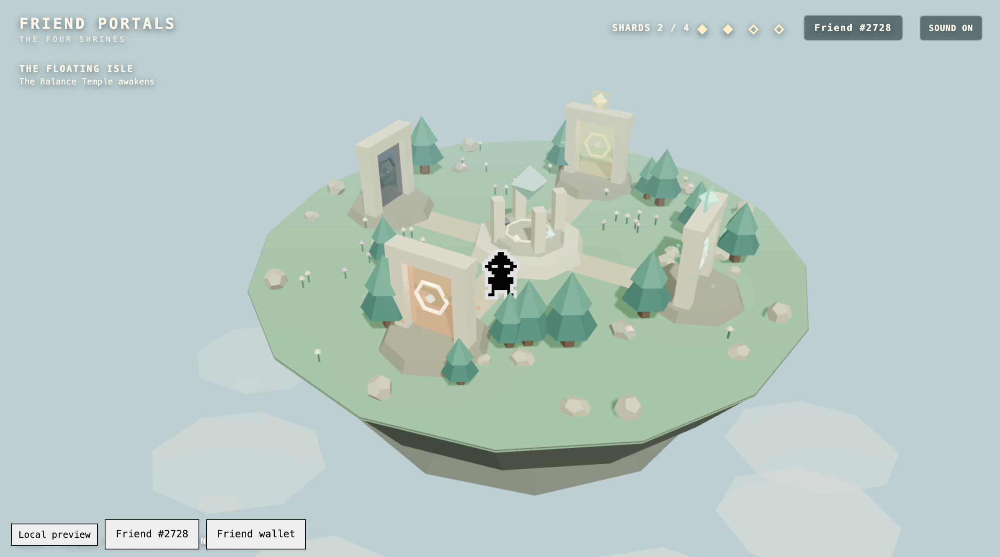
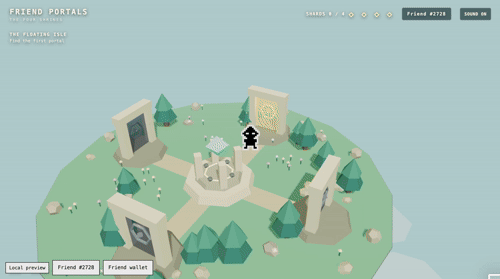

# Friend Portals

Explore a floating 3D island as your own Rare Friend and restore it by completing four distinct puzzle worlds.

## Gameplay

- **Builder / contact:** @RomaMartynyuk
- **Category:** Character Spotlight
- **Source:** [Friend Portals on GitHub](https://github.com/RomaMartynyuk/friend-portals)
- **Playable preview:** [Play Friend Portals](https://romamartynyuk.github.io/friend-portals/)
- **Stack:** FriendSDK v0.1.3, TypeScript, React, React Three Fiber, Three.js

## What did you build?

Friend Portals is a 3D puzzle adventure built around the player's own Rare Friend.

The selected Friend from the connected wallet becomes the character used throughout the entire journey, with canonical FriendSDK artwork and animations integrated into the 3D world.

The adventure begins on a floating island containing four portals. Each portal leads to a different puzzle experience:

1. **Temple of Light** — rotate crystals to redirect a beam through seals and activate the Core.
2. **Echo Garden** — memorize and reproduce changing musical rune sequences.
3. **Temple of Balance** — move weighted blocks onto pressure plates to restore the temple mechanisms.
4. **Celestial Observatory** — time rotating celestial rings and align a seeded constellation.

Completing a portal awards one shard and awakens the next portal.

After collecting all four shards, the player returns to the island and activates the central monument. Light, Echo, Balance, and Celestial energy converge in a final restoration sequence that transforms the island and generates a Journey Sigil representing that run.

## Rare Friend integration

FriendSDK is central to the player experience rather than being used only for authentication.

The trusted host provides the selected eligible Friend ID. Friend Portals verifies the session through FriendSDK and loads that Friend's canonical artwork and animation frames.

The selected Friend becomes the playable character across:

- the main island;
- all four puzzle worlds;
- shard collection;
- portal transitions;
- the Restoration finale;
- the restored island.

Canonical idle and walking animations are used with directional movement, alongside FriendSDK sound cues and small Friend-colored visual effects.

Starting a New Journey changes the world and puzzle seed while keeping the player's Friend as the hero.

## Replayability

Every New Journey receives a new seed.

That seed changes several parts of the adventure independently, including:

- Temple of Light configurations;
- Echo Garden sequences;
- Temple of Balance layouts;
- Celestial constellations and ring behavior;
- island decorations;
- the final Journey Sigil.

The four core puzzle mechanics stay recognizable, but a new journey is not simply an identical replay of the previous one.

## The four portals

### I — Temple of Light

Rotate three crystals and redirect an energy beam through the temple seals toward the Core.

Multiple authored configurations are selected from the journey seed.

### II — Echo Garden

Watch and listen to sequences generated by five physical rune stones, then reproduce them by moving the Friend across the correct runes.

Sequences vary between journeys.

### III — Temple of Balance

Push weighted blocks across a suspended temple and distribute their weight correctly across pressure plates.

The selected layout, block configuration, and solution structure can change with the journey.

### IV — Celestial Observatory

Lock three independently rotating celestial rings according to a constellation clue.

Constellation, starting angles, rotation directions, and speeds are derived from the journey seed.

## The Restoration

Collecting all four shards does not immediately end the game.

The Friend returns to the central monument and manually begins The Restoration.

The four portal energies converge on the monument, the Journey Sigil forms, and the island changes into its restored state.

The player can then continue exploring the restored island or begin a completely new seeded journey.

## Technical notes

Friend Portals uses FriendSDK v0.1.3 with React Three Fiber and Three.js.

The game includes:

- canonical wallet-selected Rare Friend integration;
- canonical Friend idle and walk animation frames;
- FriendSDK sound cues;
- four independent 3D puzzle systems;
- seeded journey generation;
- centralized progression;
- duplicate-claim protection;
- portal re-entry;
- seeded finale generation;
- browser-tested full 0/4 → 4/4 journey.

Progress is currently session-based because the available FriendSDK sandbox does not expose a supported persistent save bridge.
