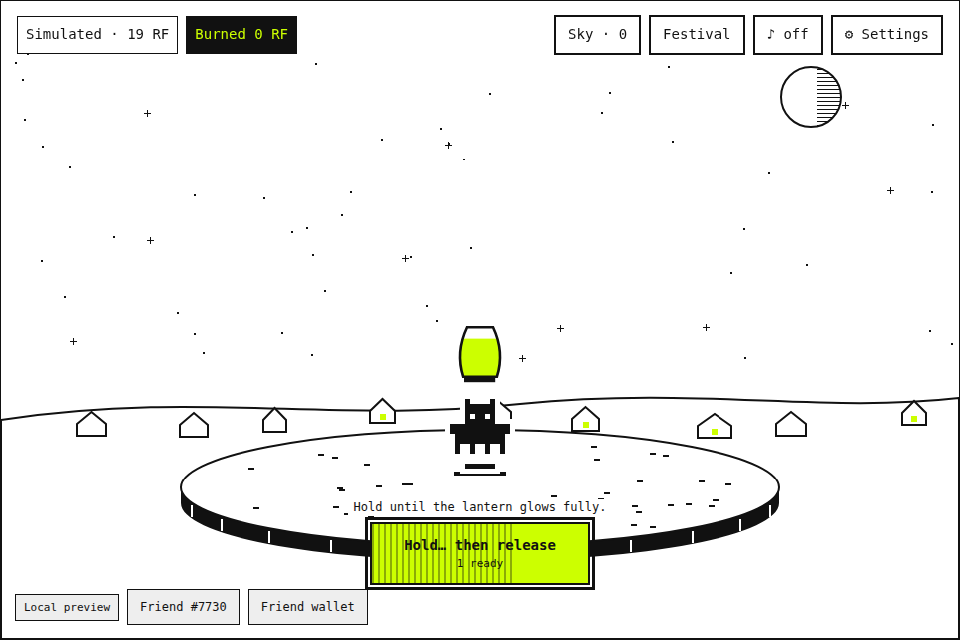
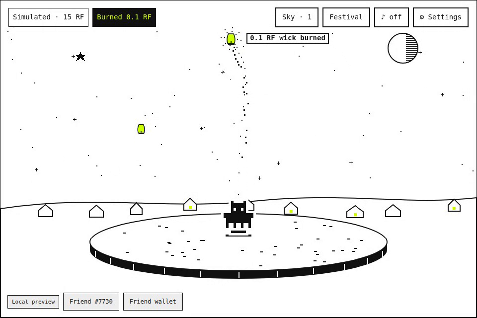
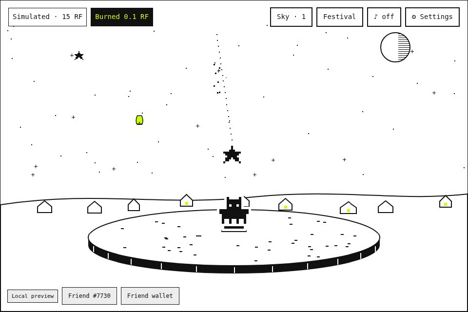
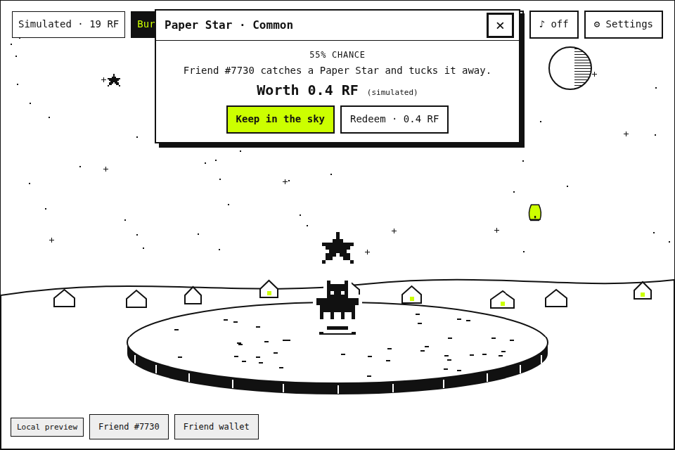
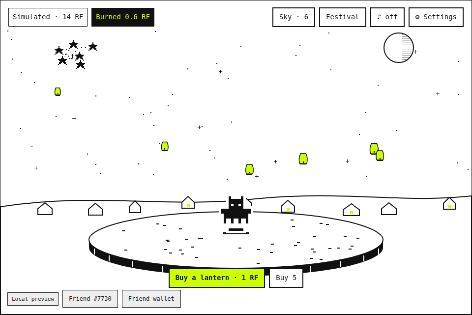
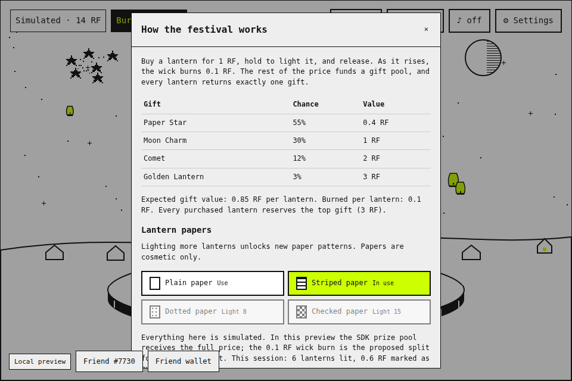
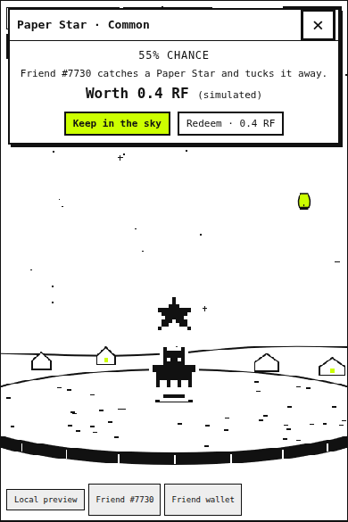

# Lantern Night

Your Rare Friend hosts a night-sky lantern festival. Every lantern costs RF to light, part of it burns as the lantern rises, and a gift drifts back down into your Friend's hands.

**Builder:** [@Boomzy60](https://github.com/Boomzy60) · **Category:** Token Activity (also entered for Character Spotlight) · **SDK:** FriendSDK v0.1.2

**One sentence:** A hold-to-light lantern festival where your own Generations Friend launches paper lanterns bought with $RAREFRIENDS. A fixed 0.1 RF wick burn per lantern is shown live, and the gifts you keep build a personal night sky.



[Source code](game/) · [Game rules (`game.json`)](game/game.json) · [Game README](game/README.md) · [Demo video (50 s, mock wallet)](media/lantern-night-demo.webm)

**Playable preview:** https://boomzy60.github.io/rarefriends-vibeathon/ (built from the `gh-pages` branch). It requires a browser wallet on Robinhood mainnet (chain 4663) holding a hardwired Generations NFT (generation ≥ 1). The economy is simulated: no RF funding, private key or transaction signature is needed.

## Why it fits

- **Token Activity.** Spending RF is the whole loop. Each lantern is a 1 RF spend, and 0.1 RF of it is marked as burned the moment you release it. An on-screen **Burned** counter tracks the total, and the burn is repeated in every round rather than being a side feature.
- **Character Spotlight.** Your Friend is centre stage for every beat. It is drawn from its canonical on-chain sprite, holds the lantern overhead as it fills with light, and hops for gifts, higher for rarer ones. The reveal card sits above the scene so the Friend stays in view.
- **Fits the Rare Friends look.** The game uses the SDK's one-bit style: white paper, black ink and a floating island echoing the starter garden, with signal green reserved for lantern light. The fun comes from motion. The lantern fills with light as you hold, rises on a dotted trail shedding embers, and returns a pixel gift. Kept gifts join dotted constellations, and rare pulls get a burst of rays.
- **Economy Potential.** The design has one sink, the wick burn, and one faucet, fixed-value gifts. It also has a cosmetic track (lantern papers) with no redemption promise, which can grow into RF-priced paper skins without new prize backing. See [Where it goes next](#where-it-goes-next).

## Run it

Use Node.js 22+ on Linux or Ubuntu/WSL2.

```sh
git clone https://github.com/spokesz/friendsdk.git
cd friendsdk
git checkout v0.1.2
npm ci
mkdir -p games/lantern-night
# copy the files from this submission's game/ folder into games/lantern-night/
npm run build
npx friendsdk dev games/lantern-night
```

Open `http://localhost:4173`, connect your wallet and select your Friend. The SDK runtime verifies ownership before play.

## Play

1. Choose **Buy a lantern · 1 RF** (or **Buy 5**) and confirm the preview action.
2. Press and hold **Hold to light** (or hold the sky) until the lantern glows fully, then release. Keyboard players can hold Space or Enter. Releasing early does not use up the lantern.
3. Confirm the preview action. The lantern rises and burns its wick, and a gift floats down to your Friend.
4. Choose **Keep in the sky** to add the gift to your constellation, or redeem it for its fixed value. **Sky** lists every kept gift, and you can redeem them at any time.
5. **Festival** shows the exact odds and lets you switch lantern paper patterns (striped, dotted, checked), which unlock after 3, 8 and 15 lanterns lit.

Settings include sound on/off (muted by default), **Reduce motion** (it follows the system setting by default) and **One tap lights a lantern** for players who can't press and hold. Everything stays inside the SDK game container: 960 × 640 on desktop. On portrait phones, an optional `host.css` switches the container to a tall 3:4 or 2:3 frame, and the scene redraws for that shape (taller sky, cropped sides) instead of stretching. On a narrow landscape screen, the controls move beside the Friend.

| Lighting | Rising, wick burning | Gift coming down | Reveal |
|---|---|---|---|
|  |  |  |  |

| Night sky after 6 lanterns | Rules and papers | Phone (390 × 844, portrait) |
|---|---|---|
|  |  |  |

## Rules and rewards

**All balances, purchases, gifts, redemptions and burns are simulated.** The SDK preview starts with 20 RF.

| Gift | Chance | Redemption value |
|---|---:|---:|
| Paper Star | 55% (5,500 bps) | 0.4 RF |
| Moon Charm | 30% (3,000 bps) | 1 RF |
| Comet | 12% (1,200 bps) | 2 RF |
| Golden Lantern | 3% (300 bps) | 3 RF |

- **Price:** 1 RF (`1000000000000000000` base units) per lantern. One lantern produces exactly one gift.
- **Expected gift value:** 0.85 RF per lantern.
- **Wick burn (proposed):** 0.1 RF per lantern lit.
- **Proposed split of each 1 RF:** 0.10 RF burned, 0.85 RF expected back to players, 0.05 RF retained by the gift pool.
- **Backing:** each purchased or pending lantern reserves the 3 RF top prize. Kept gifts keep their fixed value with no redemption expiry, and new purchases stop when backing runs short.
- **Lantern papers:** cosmetic only, with no RF value and no redemption promise.
- **How the burn is shown:** the SDK v0.1.2 preview client sends the full lantern price to its prize pool. The **Burned** counter shows the proposed 0.1 RF split for a live contract. No tokens are burned or moved in this preview.

## Where it goes next

- **Burn-routing contract.** A lantern purchase would send 0.1 RF to a burn address and 0.9 RF to the gift pool, using the SDK's existing buy, play, settle and redeem flow with Dice randomness.
- **RF-priced lantern papers.** Cosmetic skins bought with RF and burned in full would add a pure sink with no prize liability.
- **Festival nights.** A community event where every lantern lit adds to a shared sky and a global burn total, with milestones that unlock seasonal papers for everyone.
- **Persistent skies.** Each Friend's constellation would be saved once the SDK supplies a save API.

## Checks, credits and limitations

These were run from a FriendSDK v0.1.2 checkout with the game at `games/lantern-night`:

- `npm test`: 116 tests, 114 passed, 0 failed, 2 skipped (Foundry contract integration, not installed).
- `npm run typecheck`, plus a strict TypeScript check of the game sources: passed.
- `npm run check:games` and `npx friendsdk check games/lantern-night`: valid, with expected reward 0.85 RF and maximum 3 RF.
- `npx friendsdk test games/lantern-night` at 960 px, 390 px and 360 px: passed.
- `node games/lantern-night/playtest.mjs`: passed at 960 × 800, 390 × 844 (iPhone portrait), 360 × 800 and 640 × 360 (landscape phone). This scripted mock-wallet playthrough covers buying, confirming that an early release doesn't light the lantern, lighting with Space and with Enter, the reveal, keeping gifts, lighting five more lanterns, unlocking and choosing a paper, the Sky and Festival panels, the sound and reduced-motion settings, and a check that the burn counter reads 0.6 RF.
- `npx friendsdk build games/lantern-night`: built.

The browser tests use the SDK's mocked wallet and RPC with sample Friend #7730. **A real-wallet playthrough has not been done yet**, because the builder does not currently hold a Generations NFT. The ownership gate is the unmodified SDK runtime.

The scenery, lanterns and gifts are drawn procedurally in [`scene.ts`](game/scene.ts), and the menus use the SDK's `GameMenu`. The Friend comes from its canonical on-chain sprite via `@rarefriends/friendsdk/sprites`, and sound comes from the SDK sound kit. No third-party assets are used. Progress resets on reload because the SDK has no save API. No trading, wearable NFTs, creator fees or live contracts are included. Production publication needs separate Rare Friends review.
