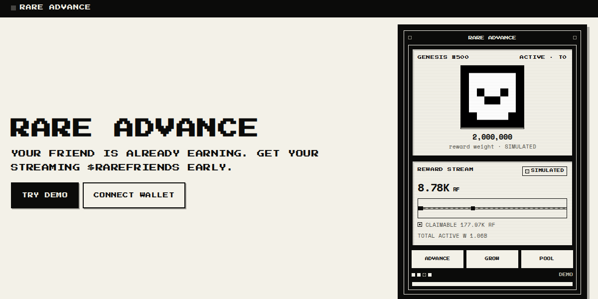

# Rare Advance

**Builder / contact:** Syrup / [@buildinginweb3](https://x.com/buildinginweb3)

**Category:** Economy Potential

**FriendSDK:** No

Rare Advance is a financial/economy web tool using its own web interface and read-only Rare Friends protocol
integration rather than the FriendSDK game runtime.

## One sentence

**Rare Advance turns an earning Rare Friend's streaming $RAREFRIENDS rewards into liquidity today, while creating a
community-funded capital market that can also model financing for activation, hardwiring, reactivation,
promotions and upgrades from the future rewards they create.**

---

## ▶ PLAY RARE ADVANCE

**https://buildinginweb3.github.io/rare-advance/**

Demo Mode needs **no wallet**, **no Rare Friend** and **no RF**. Press **Try Demo**.

## SOURCE CODE

**https://github.com/buildinginweb3/rare-advance**

## SUBMITTED SOURCE COMMIT

**[`2216572cc13377f894d4fb098351fd8e9d74877e`](https://github.com/buildinginweb3/rare-advance/tree/2216572cc13377f894d4fb098351fd8e9d74877e)**

This is the exact commit behind the public demo linked above.

---



<sub>The real deployed app. The portrait is the genuine onchain `tokenURI()` artwork, read from the
collection contract. Reward figures are labelled SIMULATED.</sub>

---

## What it is

Rare Friends can receive `$RAREFRIENDS` and WETH rewards over time.

Rare Advance explores a market where holders can turn eligible streaming RF rewards into liquidity before the
stream finishes.

Instead of Rare Advance setting one universal price, **liquidity providers create pools with their own terms**.
Other users can contribute RF to compatible public pools, and Rare Friend holders choose which available pool
they want to use.

The same market can model financing for existing Rare Friends growth actions, including activation, hardwiring,
reactivation, promotion and tier upgrades.

No DeFi experience is needed to try it. Everything runs in a browser, against a simulated market, in Demo Mode.

## Why Economy Potential

Rare Friends already has a functioning reward economy. Rare Friends already consume RF: activating,
hardwiring, reactivating, promoting and upgrading a Friend all cost RF and all change its **reward weight**,
which determines its share of a **seven-day** reward stream of **RF and WETH**.

Rare Advance adds the missing half of that economy: a **market for RF liquidity**.

| Rare Friends already has | Rare Advance adds |
| --- | --- |
| RF-consuming protocol actions | A market for RF liquidity |
| Reward weight | Community-created liquidity pools |
| RF rewards | Communal pool participation |
| WETH rewards | Competing financing terms |
| Seven-day reward streaming | Recycling of returned RF capital |
| Activation, hardwiring, reactivation | Reward advances |
| Promotion, tier upgrades | Modeled growth financing |
| | Optional temporary WETH participation |

This is why it belongs in **Economy Potential** rather than merely **Token Activity**: Rare Advance does not
just spend RF, it creates a secondary market *around* RF and gives RF a velocity it does not currently have.

**The advance flywheel**

```
RF HOLDERS
  → PROVIDE LIQUIDITY
  → POOLS COMPETE ON TERMS
  → RARE FRIEND HOLDERS CHOOSE CAPITAL
  → ADVANCE / GROWTH FINANCING
  → SETTLEMENT
  → CAPITAL RETURNS TO LPs
  → CAPITAL CAN FUND THE NEXT POSITION
```

**The growth flywheel**

```
RF LIQUIDITY
  → RARE FRIENDS GROWTH ACTION
  → EXISTING PROTOCOL RF ECONOMICS
  → MORE REWARD WEIGHT
  → MORE FUTURE REWARDS
  → MODELED FINANCING REPAYMENT
```

More reward weight means a larger share of the same reward pool, which makes the pool easier to service and
makes future financing more attractive. Rare Friends does not guarantee any token value, and neither does this
project.

## How it works

### Reward advances

An eligible streaming RF reward can be advanced. The user chooses the **amount**, an **eligible liquidity
pool**, and therefore the **terms**.

Worked example on the demo default terms:

| Line | Amount |
| --- | --- |
| Eligible streaming RF | 1,000 RF |
| Received now | **950 RF** |
| Maximum LP premium | 40 RF (4%) |
| Rare Advance fee / burn | 10 RF (1%) |
| Settlement target | 1,000 RF out of the Friend's stream |

**These are SIMULATED MARKET TERMS.** No RF is moved, burned or transferred. The "fee" is a modelled bucket
that funds Rare Advance's own simulated burns; it is never shared with lenders.

It is a **sale of an already-streaming receivable at a discount**, not a loan:

- nothing compounds, and no interest accrues after you accept;
- premium is capped at the quoted maximum and only vests with elapsed time;
- you can end the arrangement at any time and only pay the premium earned so far.

### Liquidity pools

Anyone in the simulated market can create a liquidity pool. The creator sets:

- **public or private**;
- **eligible financing type** (reward advances, growth financing, or both);
- **LP premium**, which can be set as high as 100%;
- **maximum financing size**;
- **RF reward routing**, up to 100%;
- **minimum borrower contribution** (derived, so the two can never contradict);
- **optional WETH participation** for Growth;
- **eligible growth actions and generations**;
- **pool capital**.

**Public pools** are discoverable, other users may contribute RF, and compatible borrowers may choose them.

**Private pools** are visible only to someone with access. They can be creator-only, or open to invited
liquidity providers and borrowers via an invite code or allowlist.

Other contributors join on the pool's **existing** terms.

There is deliberately **no "maximum financing" setting**. Capping how much a pool
lends does not protect the pool, because every borrower repays the same premium
on whatever they took: a borrower who wants more RF simply takes it from another
pool. A pool either wants the business or it does not.

### Communal pool accounting

Pool capital can come from **multiple liquidity providers**.

When a financing position opens, Rare Advance **snapshots which LP capital funded that position**. The RF
principal repayment, the RF LP premium, and any modeled WETH participation are then allocated according to
**that position-specific funding snapshot**.

An LP who joins *after* a position opened is absent from its snapshot and can never receive economics from a
position they did not fund.

### Pool terms lock

Pool economic terms **lock** when either:

- another LP participates in the pool, or
- a financing position opens.

This prevents a creator from changing terms after participants have committed capital. If different terms are
wanted, **clone the pool with new terms**.

### Borrower choice

Rare Advance does **not** force one financing price. A holder compares compatible pools:

For **reward advances**: RF received now, maximum total cost, and pool liquidity.

For **Growth financing**: RF financed, RF required upfront, RF premium, RF reward routing, and WETH share.

Badges are strictly factual. **Rare Advance never names a single best pool**, because the terms are genuinely
two-sided: a pool with a lower premium may have less liquidity, and a pool offering a WETH share is paying for
it by taking a cut of your WETH.

### Growth financing

Grow **models** financing for valid Rare Friends protocol actions. Depending on the Friend's state:

- **Genesis**: activation
- **Generations**: hardwire, reactivate, promote, upgrade

The pool supplies simulated RF. The holder may supply an owner contribution. The growth action changes reward
weight according to Rare Friends protocol rules. A configurable portion of modeled future RF rewards can repay
the financing.

A borrower can choose to put in anything from 0% to 100% of the cost. At 0% a
lender funds the whole action; at 100% there is nothing left to finance and the
app says so rather than showing an empty list. Every seeded pool can fund a
promotion as well as an upgrade.

**All of this financing is SIMULATED. No real protocol action executes.**

### WETH participation

Rare Friends rewards are **RF and WETH**, not raw ETH.

Growth pools may optionally request a **temporary** percentage of the Friend's **modeled** WETH rewards while
financing remains outstanding. For example, at a 10% WETH share:

| Stage | Modeled WETH split |
| --- | --- |
| During financing | 90% to the Friend owner, 10% to the financing pool |
| After financing settles | **100% to the Friend owner** |

WETH participation **does not continue permanently**; it stops the instant the RF repayment target is met.
WETH is accounted **separately** from RF and is never silently converted into RF.

### Repayment

A financing position can settle through modeled reward routing, manual simulated RF repayment, or a
combination of both. Users can repay **partially** or **pay off fully**.

Once financing settles:

- RF routing ends;
- WETH participation ends;
- the Friend receives 100% of modeled future rewards.

Paying off early only ever charges the premium earned so far.

## How to try it

### Demo mode

Demo Mode is the easiest path and needs no wallet.

1. Open [the demo](https://buildinginweb3.github.io/rare-advance/) and press **Try Demo**.
2. Use the preselected Rare Friend — a real hardwired Generation 2 — or press **Change Friend**. The demo
   wallet holds both a Genesis and a Generation, so you can compare a Friend that can grow with one that
   cannot.
3. Press **Get this stream early**.
4. Choose how much streaming RF to advance (presets or a specific amount).
5. Compare the available liquidity pools.
6. Pick an offer and **Confirm**.
7. Press **Simulate time** to watch the stream settle.
8. Repay partially or **Pay off** fully.
9. Open **Grow**, choose a valid Rare Friends action, compare eligible Growth pools, and inspect the RF and
   WETH terms.
10. Open **Liquidity** to create your own pool or contribute RF to a compatible public pool.

### Real wallet mode

- A browser wallet is required (MetaMask, Rabby or any EIP-1193 wallet).
- **Robinhood Chain mainnet**, chain **4663**, is required for live reads.
- Interaction is **read-only**. The only wallet methods this app can issue are `eth_requestAccounts`,
  `eth_accounts`, `eth_chainId`, `wallet_switchEthereumChain` and `wallet_addEthereumChain`.
- **Rare Friends Genesis** and **Rare Friends Generations** are both supported.

This build does **NOT** request: RF approval, NFT approval, token transfer, NFT transfer, live liquidity
deposit, live activation, live upgrade, or any real financing transaction.

## Rare Friends integration

**Direct Robinhood Chain reads** (authoritative, read-only):

- `ownerOf` for ownership verification
- NFT artwork via each collection contract's own `tokenURI()`
- activation and reward position state
- generation and tier
- token-bound account
- earned / claimable reward data
- `totalWeight` and aggregate protocol state

**First-party Rare Friends endpoints**, where used:

- `/api/protocol/owned-nfts` — NFT discovery for a connected wallet
- `/api/protocol/snapshot` — optional public protocol snapshot

The first-party API sends no CORS headers, so in development and preview the app reaches it through its own
same-origin read-only proxy paths (`/api/rf-owned-nfts`, `/api/rf-snapshot`). Those proxies are plain
JSON/JSON-RPC pass-throughs.

**OpenSea API v2** is used only as a **secondary** source for NFT traits and canonical marketplace URLs, and as
a fallback image. OpenSea ownership is never trusted for economics: ownership is always re-verified with a
direct onchain `ownerOf()` read.

**What the deployed build can actually do.** Measured on 2026-09-30 against the public deployment:

- The first-party `/api/protocol/owned-nfts` responds `200` with correct data but sends no
  `access-control-allow-origin` header, so a browser on static hosting cannot read it. The same-origin
  proxy paths that solve this exist only in the Vite dev/preview server, which is why the bug could be
  invisible locally and reproducible on Pages.
- OpenSea serves these tokens, but only on the chain-scoped, singular-account path
  `/api/v2/chain/robinhood/account/{address}/nfts`. The un-scoped `/api/v2/accounts/{address}/nfts`
  path does not exist and returns 404, which previously made every wallet miss the fast route.
- The public RPC rejects `eth_getLogs` outright (HTTP 403) at every block range, so event-based discovery
  is unavailable.
- `Generations` exposes no owner index: `totalSupply()`, `balanceOf()` and `tokenOfOwnerByIndex()` all
  revert, and its ids are sparse (4,000 exists but 1 does not; 343,888 exists but 345,000 does not), so
  an id-range binary search would be unsound.

Discovery therefore resolves by a **direct onchain sweep of every token id of both collections**, bundled
through Multicall3 `aggregate3`, which is deployed on Robinhood Chain. That turns 345,000 individual
`ownerOf` reads into ~87 requests. Ownership is still confirmed per token by the `ownerOf` value returned
in the bundle, so nothing is trusted from an index.

Ownership from an index is still always re-confirmed with a direct onchain `ownerOf` read, so an index can
never decide what a wallet owns; it only narrows the candidate set fast.

Discovery is ordered: first-party index, then OpenSea, then the onchain sweep. With OpenSea answering,
the deployed build verifies wallet `0x927A1799125EAE57B6BDc573Ee5e0354cD343Db1` and loads Generations
#84370 and #193474 — matching the first-party index exactly — in about **2 seconds** on the live site.

The sweep remains the last resort for when no index answers, and it is exhaustive: it reports
`exhaustive: false` if any bundle cannot be read even after one retry, so a flaky RPC can never be rendered
as "this wallet owns nothing". It takes roughly 45 seconds against the public RPC, during which the UI
states **VERIFYING YOUR FRIENDS** rather than showing an empty result.

**OpenSea API v2** is used only as a **secondary** source for NFT traits and canonical marketplace URLs, and as
a fallback image. OpenSea ownership is never trusted for economics: ownership is always re-verified with a
direct onchain `ownerOf()` read.

**What the deployed build can actually do.** Measured on 2026-09-30 against the public deployment:

- The first-party `/api/protocol/owned-nfts` responds `200` but sends no `access-control-allow-origin` header,
  so a browser on static hosting cannot read it, and the same-origin proxy paths return `404` on GitHub Pages.
- OpenSea's `/api/v2/accounts/{address}/nfts` does not serve these tokens, so it is not a usable discovery
  route for them either.

## $RAREFRIENDS economy

RF is what Rare Friends actions consume and what rewards are paid in. Rare Advance does two things with it:

1. **Advances** a Friend's streaming RF rewards for cash-equivalent RF today, at a discount, with the remainder
   settling out of the stream over its term.
2. **Finances growth**, so a Friend's activation, hardwiring, reactivation, promotion or upgrade can be paid
   for from the future rewards that the added reward weight creates.

RF that settles back to a pool returns to its lenders and becomes available to fund the next position. That
recycling is the point: RF is not destroyed once, it is intermediated.

## Public and private pools

| | Public pool | Private pool |
| --- | --- | --- |
| Discoverable | Yes | Only to someone with access |
| Other users may contribute RF | Yes | Per the pool's access rule |
| Compatible borrowers may choose it | Yes | Per the pool's access rule |
| Access modes | — | Creator-only, or invited LPs / borrowers via code or allowlist |

## WETH participation

See [WETH participation](#weth-participation). WETH is separate accounting, temporary, and never becomes RF.

### Claimable vs still streaming

Rare Friends can hold two different kinds of RF at once, and Rare Advance treats
them very differently.

**Claimable now** is RF the Friend owner can already take. Where Rare Friends
exposes it, this is read directly from supported onchain protocol state
(`LIVE · ONCHAIN`).

**Still streaming** is the amount that is still arriving over the current reward
stream. Rare Friends does not expose a direct per-Friend pending getter, so
Rare Advance **derives** this from live protocol state:

```
friend share    = friend reward weight / total active reward weight
still streaming = friend share x remaining funded RF stream
```

That derivation is labelled **MODELED**, not live. It never overstates the
slice: division rounds down.

**Rare Advance advances against the eligible still-streaming amount**, not
against RF that is already claimable. Choosing MAX in the app takes the whole
still-streaming receivable and nothing more.

---

## Real vs simulated

### Live / read-only

- wallet address
- Rare Friends ownership
- onchain NFT artwork (`tokenURI()`)
- generation and tier
- activation status
- reward weight
- claimable / earned reward data
- aggregate protocol state and total active weight

### Modeled from live protocol state

- the selected Friend's still-streaming RF, derived from live stream state and its reward weight
- future reward estimates
- payback duration
- Growth financing repayment estimates

### Simulated

- RF liquidity deposits and withdrawals
- pool creation
- public / private pool participation
- reward advances
- LP premiums
- Rare Advance fee / burn
- financing settlement
- manual repayments
- growth financing
- WETH routing
- actual protocol growth execution

**No real RF, WETH or NFTs move in the Vibeathon build.**

## Data sources

| Source | Role |
| --- | --- |
| **Onchain (Robinhood Chain)** | Authoritative for supported protocol state and ownership |
| **Rare Friends first-party API** | Supplementary, where used |
| **OpenSea API v2** | Secondary NFT trait and marketplace metadata, and a fallback image |
| **Modeled** | Forward-looking calculations |
| **Simulated** | All Rare Advance financial activity |

**Onchain state wins if an indexer disagrees.** An OpenSea or first-party index that disagrees with a direct
`ownerOf()` read is treated as wrong.

## Future support / integration

The Vibeathon build already reads supported Rare Friends state onchain and models
the Rare Advance market end to end: reward advances, communal liquidity pools,
borrower-selected terms, manual repayment and Growth financing. Public and
private pools, communal LP contributions, position-specific allocation and
temporary WETH participation all work in the model today.

`Claimable now` is read directly from the protocol where supported.
`Still streaming` — the amount Rare Advance advances against — is currently
derived from live Rare Friends reward-stream state and the selected Friend's
reward weight, because no direct per-Friend pending getter is available.

**The production requirement is a reliable, auditable way to know exactly how much
RF remains attributable to each financed Friend.** A direct Rare Friends getter
would make that simpler and more robust; a deterministic, verifiable derivation
from protocol state may be sufficient, so a brand-new API is not assumed to be a
prerequisite.

Taking Rare Advance from simulation to production mainly needs an audited
settlement layer for:

- real RF deposits and withdrawals in liquidity pools;
- routing or escrowing the financed portion of RF rewards while a position is
  active;
- routing any agreed temporary WETH share for Growth financing;
- accepting real RF manual repayments and releasing reward routing once the
  position settles;
- executing financed Rare Friends activation, hardwiring, reactivation,
  promotion or upgrade actions after user approval.

A production implementation would also need a defined rule for an NFT transfer
while financing is still active.

The existing Rare Friends contracts remain responsible for reward generation,
reward weight and growth mechanics; Rare Advance adds the financing and
settlement layer around them.

## Stack

| Layer | Choice |
| --- | --- |
| UI | React 18 + TypeScript 5.7 |
| Build | Vite 6 |
| Chain | viem 2.21, Robinhood Chain JSON-RPC |
| Unit tests | Vitest 2.1 |
| E2E tests | Playwright 1.49 |
| Hosting | GitHub Pages |

**FriendSDK: No.** Rare Advance is a financial/economy web tool and uses a custom read-only wallet and Rare
Friends protocol-data integration. This is valid under the Vibeathon rules for non-game tools.

## Run locally

```sh
git clone https://github.com/buildinginweb3/rare-advance.git
cd rare-advance
git checkout 2216572cc13377f894d4fb098351fd8e9d74877e
npm ci
npm run dev
```

Demo Mode runs with **no environment variables at all**.

Optional variables (see `.env.example`):

| Variable | Required | Purpose |
| --- | --- | --- |
| `VITE_OPENSEA_API_KEY` | No | Secondary traits / marketplace metadata only. Without it the app still works. |
| `VITE_RPC_URL` | No | Extra public RPC. Falls back to the official endpoint. |
| `VITE_RF_API_BASE` | No | First-party Rare Friends API base. Defaults to `https://rarefriends.com`. |

The demo build ships a deliberately public, low-privilege, rotatable OpenSea key in `.env.example`. It only
reads public NFT metadata, cannot move anything, and is never used for ownership or any economic figure.
**It is not reproduced in this submission.**

Useful scripts: `npm run dev`, `npm run build`, `npm run typecheck`, `npm test`, `npm run e2e`.

## Checks

All run against commit `2216572cc13377f894d4fb098351fd8e9d74877e`.

| Check | Result |
| --- | --- |
| Typecheck | PASS |
| Unit tests | 274 / 274 PASS |
| Wallet regression tests | 11 / 11 PASS |
| E2E (offline, against the production build) | 62 / 62 PASS |
| NFT discovery regression tests | 8 / 8 PASS |
| Production build | PASS |
| Accessibility / contrast / reduced motion | PASS |
| Desktop visual QA | PASS |
| 360px | PASS |
| 390px | PASS |
| 430px | PASS |
| Deployed-demo smoke (live URL) | 3 / 3 PASS |
| Judge-flow walkthrough (live URL, 14 flows × 4 viewports) | 56 / 56 PASS |

Validated source commit:
[`2216572cc13377f894d4fb098351fd8e9d74877e`](https://github.com/buildinginweb3/rare-advance/tree/2216572cc13377f894d4fb098351fd8e9d74877e)

## Known limitations

- Financing is **simulated**. There is no live lending or advance contract.
- Liquidity is **simulated**. There is no real reward assignment or routing mechanism.
- There is no real WETH routing.
- Growth actions are **modeled**, not executed.
- NFT-transfer behaviour while financing is outstanding remains a production design requirement.
- Reward rates vary; reward weight is allocation weight, **not** a guaranteed yield, return or ROI.
- Modeled payback timing is not guaranteed.
- User-created pools are stored in the browser (local storage) and are not shared with other users.
- OpenSea and first-party indexed metadata can lag onchain state.
- Static hosting limits use of first-party endpoints that do not send CORS headers; the deployed build falls
  back to onchain reads when they are unreachable. Discovery is exhaustive, but a bundle that cannot be read
  is reported as unverified rather than as an empty result.
- Onchain discovery bundles many `ownerOf` reads per request, which is a heavier public-RPC load than a
  single read; a dedicated RPC endpoint is recommended for real deployments.
- The demo market is a scenario, not a forecast. It is not calibrated against real liquidity demand.

## Wallet / funds safety

**Rare Advance's Vibeathon build is read-only with respect to real assets.**

It does **not**:

- request RF approvals;
- request NFT approvals;
- move RF;
- move WETH;
- move NFTs;
- deposit real liquidity;
- claim rewards;
- activate Friends;
- upgrade Friends;
- execute financing;
- request a financial signature of any kind.

Wallet connection is used for **identity and read-only discovery only**.

## Credits

- **Rare Friends** — the collection, artwork, `ActivationManager` reward accounting and protocol rules that
  this project reads and is built around. Rare Friends is a separate project; Rare Advance does not replace it.
- **OpenSea** — API v2, used secondarily for NFT traits and marketplace links.
- **viem** — Ethereum/Robinhood Chain JSON-RPC client.
- **React**, **TypeScript**, **Vite**, **Vitest**, **Playwright** — open-source tooling.

All Rare Friends artwork shown in this project is read directly from the official collection contracts and is
not redistributed, recoloured or redrawn.