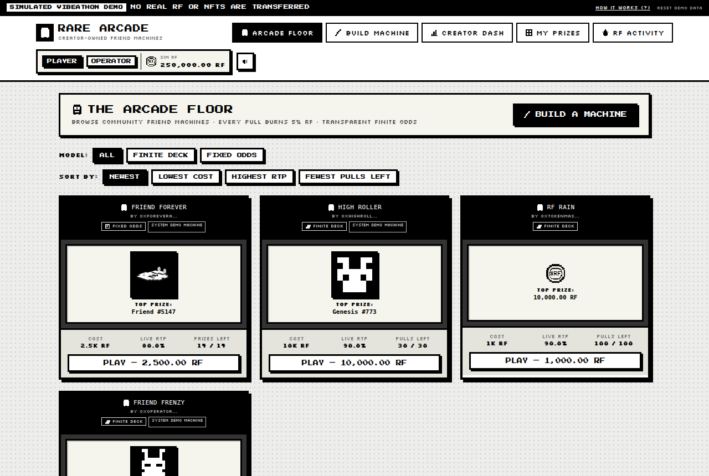

# Rare Arcade



**Builder / contact:** Syrup / [@buildinginweb3](https://x.com/buildinginweb3) on X
**Category:** Token Activity

## One sentence

Rare Arcade turns NFTs and $RAREFRIENDS you already hold into creator-run prize
machines where every pull spends $RAREFRIENDS, burns 5%, and uses live OpenSea
data to price prizes transparently—giving otherwise idle holdings active utility
and creators a way to earn from the machines they build.

**Demo note:** RF spending, the 5% burn, creator receipts and prize settlement
are simulated; wallet ownership and OpenSea market data are live/read-only.

**[PLAY RARE ARCADE](https://buildinginweb3.github.io/rare-arcade/)**
· **[SOURCE CODE](https://github.com/buildinginweb3/rare-arcade)**

## What did you build?

Rare Arcade is a **creator-built prize-machine marketplace powered by
$RAREFRIENDS**.

Most chance-based NFT apps are single-sided: one developer launches a house
machine, players pull, and activity dies when the content dries up. Rare Arcade
inverts that. **Anyone can build a machine.** Instead of a developer controlling
one central prize pool, the asset holder becomes the machine operator:

```
NFT / RF YOU ALREADY HOLD
        ↓
  MACHINE INVENTORY
        ↓
  TRANSPARENT MACHINE ECONOMICS
        ↓
  PLAYERS SPEND $RAREFRIENDS
        ↓
  5% RF BURN  +  95% CREATOR RECEIPTS
        ↓
  HOLDINGS NOW DO SOMETHING
```

A creator takes an NFT or a balance of RF they already own, sets it as prize
inventory, chooses a machine model, configures pull price and RTP, and publishes.
Players can browse those machines, read the **entire prize pool, exact odds, live
RTP and burn before pulling**, then spend RF to pull. Every pull runs a
machine-specific cabinet animation and then reveals the prize.

So the loop is not "spend RF to gamble" — it is
**asset holder → machine creator → prize inventory → player activity → creator
receipts.** Rare Arcade gives holdings they already have an active role inside
an economy, and gives creators a way to earn from activity around the machines
they build. Creator earnings depend on prize values, pull pricing, RTP,
inventory and player activity; nothing is guaranteed.

## How does it use Rare Friends / $RAREFRIENDS?

`$RAREFRIENDS` is the single economic unit across the whole product.

- Every pull spends RF at the machine's own pull price.
- Exactly **5% of every pull is burned**; the remaining **95% becomes simulated
  creator receipts**.
- Creators can also **seed RF directly as prize inventory**, so RF works as both
  the currency and the prize.
- Supported NFT market references are **converted into RF**, so prizes, odds and
  RTP all live in one shared economy rather than per-collection silos.

Rare Friends NFTs are first-class throughout: they are the marquee prize type,
they get the richest valuation path (collection, contract, and generation-level
trait offers), and the whole product is a Rare Friends arcade — from the `$RF`
pixel coin to the monochrome cabinets.

The demo economy starts a player at **250,000 RF** and an operator at
**2,500,000 RF**.

## Two machine models, both shipped

| | **Finite Deck** | **Fixed Odds** |
|---|---|---|
| Play cap | Fixed ticket count | None |
| Odds | Shift as inventory depletes, live RTP recalculates | Each prize keeps its configured probability |
| Sold-out slot | — | Becomes an **empty outcome**; probability is *not* redistributed |
| Ends when | Tickets run out | All prize inventory is exhausted |

Both publish exact odds, configured RTP, current RTP, and the full prize
inventory **before** a player pulls. Every creator machine publishes its own
economics; any modeled creator margin is implied by the published RTP and 5%
burn, with no hidden weighting. Seeded demo machines run at 80–90% RTP, so a
creator margin is expected there.

## Source code

<https://github.com/buildinginweb3/rare-arcade> · commit
[`bf889d0`](https://github.com/buildinginweb3/rare-arcade/tree/bf889d042f9a64bb92614ffa4d1207a75838d3f5)

```sh
git clone https://github.com/buildinginweb3/rare-arcade.git
cd rare-arcade
git checkout bf889d042f9a64bb92614ffa4d1207a75838d3f5
npm ci
npm run dev
```

Open the printed URL (normally `http://localhost:4173`). Requires Node.js 20+.

**FriendSDK: No.** Rare Arcade is a web app, not an SDK game — it needs a
multi-panel economy UI, an NFT picker and market-data integration that the
960 × 640 SDK container is not a fit for. It connects to Rare Friends directly
through OpenSea metadata/market data on Robinhood mainnet and through the
`$RAREFRIENDS` economy.

**Stack:** React 19 · TypeScript · Vite 6 · OpenSea API v2 (`robinhood` chain) ·
Robinhood Chain JSON-RPC (read-only) · Vitest · Playwright

## Working demo

**<https://buildinginweb3.github.io/rare-arcade/>**

Hosted on GitHub Pages from the source repo (auto-deployed on every push to
`main`).

**Wallet / network requirements:** **none to try the seeded player demo.** A
fresh visitor can browse machines, inspect prize pools and odds, pull, and build
and publish a machine with no wallet at all. Connecting a wallet
(`0x…`, Robinhood mainnet / chain ID 4663) is only needed to exercise the
optional creator-side path: discovering NFTs the connected wallet holds and
verifying ownership on-chain.

The demo ships a read-only, rate-limited public OpenSea demo key so live NFT
discovery works with no setup. If a judge's IP is rate-limited, every seeded
machine still pulls normally — seeded prizes carry labelled demo valuation
snapshots.

## How to use it

1. Open the demo and click **PLAY ARCADE**.
2. On **ARCADE FLOOR**, each machine card shows its top prize, cost, live RTP and
   remaining prizes/pulls. Pick one.
3. On the machine, open **PRIZES** for the full prize pool and **ODDS** for the
   exact probability table and burn split.
4. Click **PULL — \<price\> RF**. The cabinet ritual plays (Prize Drum, Capsule
   Open, Claw Grab, or Slot Reels), then the prize reveals.
5. Check **MY PRIZES** for won collectibles and won RF, and **RF ACTIVITY** for
   the spend/burn/receipt ledger.
6. Open **BUILD MACHINE**: pick a shell and a model (Finite Deck or Fixed
   Odds), seed RF prizes (and supported wallet-owned NFTs if connected), configure
   the economics with the RTP assist and risk model, then publish. Your machine
   appears on the arcade floor immediately.

## Machine economics

- Pull price is **per machine**, set by the creator.
- Every pull: **5% RF burned, 95% to simulated creator receipts.**
- Odds, prize inventory, configured RTP and burn are all visible before pulling.
- RF prizes and NFT prizes are both supported.
- **Finite Deck** consumes tickets from a known total; live RTP recalculates as
  inventory depletes; a first pull permanently locks a machine's economics and
  inventory, and an unpulled machine can be cancelled with a full simulated
  refund.
- **Fixed Odds** rolls each prize's configured probability per pull; a sold-out
  slot becomes an empty outcome rather than redistributing its probability.

## NFT / OpenSea integration

Creators never hand-guess "this NFT is worth 20,000 RF". Rare Arcade derives an RF
reference from real market data:

```
collection top-bid USD  ÷  current $RAREFRIENDS USD  =  RF market reference
```

This is live and working, not a stub. One detail that matters: **OpenSea's offer
`price.value` is the total order amount**, so a bulk/criteria bid covering 25
tokens reads ~25× too high if taken at face value. Rare Arcade divides by the NFT
consideration quantity first. Without that, top-bid valuation is badly inflated.

- **Discovery** — supported NFTs held by the connected wallet are listed and
  filtered to eligible collections.
- **Ownership** — verified on-chain via `ownerOf` against Robinhood mainnet;
  funding is blocked if the on-chain owner disagrees with the connected wallet.
- **Genesis** — valued via the Genesis collection.
- **Generations** — generation-aware: the generation trait is read from
  collection traits and generation-level trait offers are requested. Where no
  generation-specific trait bids exist (currently true for Generations #8283),
  it **falls back to the per-item collection top bid** and labels the fallback.
- **Locked snapshots** — valuation is snapshotted immediately before publish, so
  later market moves cannot mutate a published machine's RTP or EV.

The valuation basis is the **highest active offer (top bid)**, not a floor price.
The resulting market reference is a **reference used by Rare Arcade's economics
model, not a guaranteed sale value** for an individual NFT, and not the amount a
creator can expect to realise.

## Real vs simulated

**Real / read-only**

- Connected wallet address
- NFT ownership where verified on-chain via `ownerOf`
- NFT metadata and artwork
- Collection identity
- OpenSea market data
- `$RAREFRIENDS` market-price reference

**Simulated**

- RF balances
- RF machine funding
- RF spending
- 5% RF burn
- Creator receipts
- NFT machine funding, escrow and prize payout

Rare Arcade requests **no** NFT approvals, **no** RF approvals, **no** transfers
and **no** transaction signatures. Read-only ownership checks are not escrow.
A persistent banner states the simulation on every page.

## Future support / integration

The Vibeathon build intentionally keeps the economy simulated. Moving Rare
Arcade from this MVP into a live economy would require additional production
integration:

- **Live $RAREFRIENDS settlement** — real pull spending, the 5% burn, and creator
  receipts would require approved on-chain $RAREFRIENDS integration rather than
  browser-state simulation. The 5% burn and 95% creator split are currently
  computed in app state only; no contract is deployed and no tokens move.

- **NFT escrow and prize settlement** — creator-funded NFTs would require secure
  production escrow and transfer infrastructure before real NFT prizes could be
  deposited, held, or awarded. Read-only `ownerOf` checks are not escrow, and no
  NFT is transferred today.

- **Verifiable randomness** — live prize settlement would require
  production-grade verifiable randomness, such as VRF or another approved
  mechanism. Draws currently run in the browser from Web Crypto randomness
  (`crypto.getRandomValues`) with a `Math.random` fallback, which players cannot
  independently verify or audit on-chain.

- **Persistent backend state** — machines, balances, prize inventories, and the
  ledger currently persist in `localStorage` (`rare-arcade:v1`) on the current
  browser only. A live version would require durable production persistence and
  synchronization across sessions and devices.

- **Production publication** — enabling a live economy or official Rare Friends
  deployment would require the appropriate Rare Friends production review and
  approval before any real assets or funds are involved.

## Checks

All run against commit `bf889d04`:

| Check | Result |
|---|---|
| `npx tsc --noEmit` (typecheck) | **PASS** |
| `npm test` (Vitest unit/economics/valuation) | **PASS** — 237 tests, 22 files |
| `npm run build` (production build) | **PASS** |
| `npx playwright test` (E2E) | **PASS** — 42 tests, chromium + mobile (8 opt-in deployed-demo tests skip locally) |
| `npm run test:fx` (visual QA) | **PASS** — 31 deterministic screenshot checks |
| `npm run check:live` (read-only OpenSea + RPC) | **PASS** — 18/18 |
| Public demo smoke test, chromium + mobile | **PASS** — 8/8 |
| Desktop / 360px / 390px / 430px | **PASS** — no horizontal overflow |

The deployed demo at <https://buildinginweb3.github.io/rare-arcade/> is built
from this commit by a GitHub Pages workflow that re-runs typecheck, unit tests
and the production build on every push, so the published build is gated on the
same checks.

The live check confirms, against production endpoints: OpenSea supports the
`robinhood` chain; Generations #8283 and Genesis #773 resolve with artwork;
holder inventory lists eligible NFTs; the item best-offer endpoint responds; the
`$RAREFRIENDS` USD price resolves; the generation trait is detected and the
trait-offer request succeeds; the collection top-bid fallback resolves per-item;
top-bid → RF conversion succeeds; Robinhood RPC `chainId == 4663`; and `ownerOf`
returns the holder. It is read-only — nothing is transacted.

The public demo smoke test runs against the deployed GitHub Pages build in a
clean session: browse machines, perform a real pull and assert the RF balance
decreases, build and publish an RF-only machine end to end, and check mobile
overflow.

Browser tests use a mocked wallet/RPC. A real-wallet playthrough is outstanding.

## Known limitations

- Balances, RF spend, 5% burn, creator receipts, NFT escrow and NFT prize payout
  are **simulated in browser state**. No contracts are deployed to Robinhood
  mainnet, and there is no real burn or settlement.
- State persists in **`localStorage` (`rare-arcade:v1`)** on the current browser
  only. There is no server, no accounts, and no cross-device sync. Clearing site
  data resets the demo.
- NFT discovery and valuation depend on **OpenSea availability and rate
  limits**. A read-only public demo key ships in the client bundle so the demo
  works with no setup; it is low-privilege and rotatable. Production should use
  a server-side proxy.
- Generation-level trait offers currently return no bids for the seeded
  Generations example, so generation-specific valuation falls back to the
  per-item collection top bid. The fallback is labelled in the UI.
- Creator earnings depend on player activity, prize values, pull pricing, RTP
  and inventory. **No income, return or profitability is guaranteed.**
- **No trading, creator fees, live economy, or production publication.** Rare
  Friends' own production review is a separate step.

## Credits

- **Rare Friends** — NFT names, artwork and metadata belong to Rare Friends.
  Live art is fetched from the collection's OpenSea metadata; the 16×16 pixel
  sprite fallback is original Rare Arcade code.
- **OpenSea** — NFT discovery, metadata, artwork and market data via the
  [OpenSea API v2](https://docs.opensea.io/).
- **Robinhood Chain** — read-only JSON-RPC for `ownerOf` verification (chain ID
  4663). No writes.
- **Fonts** — [Press Start 2P](https://fonts.google.com/specimen/Press+Start+2P)
  and [Silkscreen](https://fonts.google.com/specimen/Silkscreen) via Google
  Fonts (SIL Open Font License).
- **Audio** — all sound effects synthesised at runtime with the Web Audio API; no
  sampled audio files are bundled.
- All Rare Arcade pixel artwork (cabinets, `$RF` coin, icons, pull FX) is
  original to this project and defined in code as SVG.
