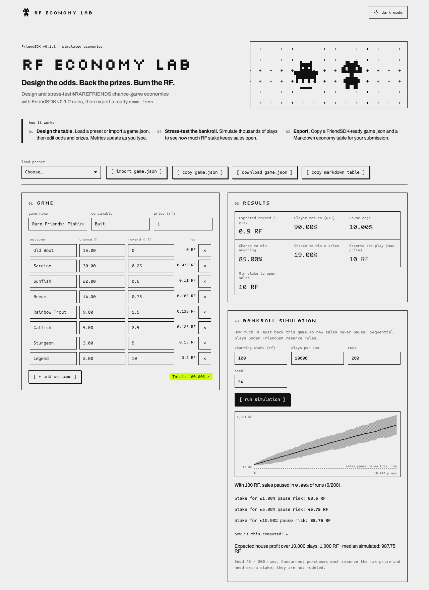

# RF Economy Lab

**Project name:** RF Economy Lab

**Builder / contact:** afuro · [@afurourrego](https://github.com/afurourrego) · [X @afurourrego](https://x.com/afurourrego)

**Category:** Economy Potential



**What did you build?**
A web tool for Rare Friends builders to design and stress-test $RAREFRIENDS chance-game economies with the
official FriendSDK v0.1.2 rules, then export a ready-to-use `game.json` and a Markdown economy table.

**How does it use Rare Friends?**
Every price and prize is in RF. The Lab runs FriendSDK's own chance-game functions (`parseChanceGame`,
`expectedReward`, `maximumPrize`, `outcomeForRoll`) so its numbers match `friendsdk check`, and it projects
RF sinks and burn against the live RF supply read from Robinhood Chain.

**How RF is spent, and the economy**
The tool itself spends no RF. It helps every other game design an RF economy: odds, player return, house
edge, the stake needed to keep sales open, and how much RF extra sinks (cosmetics, upgrades) would burn.
Example: the SDK's own Fishing table can open sales with a 10 RF stake, but the Lab shows it needs about
68.5 RF to keep the risk of pausing sales at or below 1 % over 10,000 plays (seed 42, 200 runs).

**What would be on-chain?**
Nothing in the tool. Exported `game.json` files target the SDK's existing ChanceGame contracts; sink designs
document future integrations the SDK does not yet support.

**How does it use randomness?**
A seeded PRNG for reproducible simulations only, mapped to outcomes by the SDK's `outcomeForRoll`.
Paid outcomes in real games stay with the SDK's contracts and Dice RNG.

**Source code:** <https://github.com/afurourrego/rf-economy-lab/tree/ae1d5610453431362223022ca2f5b128610f6f13> · FriendSDK v0.1.2 (release archive)

**Playable demo / how to run:** <https://afurourrego.github.io/rf-economy-lab/> — no wallet needed. It reads the RF supply from the public Robinhood Chain RPC (chain 4663) and falls back to a dated snapshot when offline.

```sh
git clone https://github.com/afurourrego/rf-economy-lab.git
cd rf-economy-lab
npm ci
npm run dev
```

**How do you use it?**
1. Load a preset (Fishing, Garden Packs) or import any `game.json`.
2. Edit outcomes, chances and rewards; results update instantly.
3. Run the bankroll simulation to see the stake needed for ≤1 %, ≤5 % or ≤10 % pause risk.
4. Optionally add RF sinks to project spend and burn per N players.
5. Export `game.json` and the Markdown table for your own submission.

**Costs and rewards:** none. The tool is free and fully simulated.

**What have you tested?**
Unit tests (Vitest) for exact RF parsing, metrics (reproduces the Fishing table: EV 0.90 RF, 10 % edge),
exact `game.json` export matching the SDK's example files, and a step-by-step conformance test of the
simulation against FriendSDK's `createGamePreview`. TypeScript typecheck and production build pass. Playwright smoke tests on desktop and 360 px mobile.

**Known limitations**
Models one consumable with sequential plays; concurrent purchases need extra reserve and are not modeled.
Sinks are design projections, not SDK features. Supply falls back to a dated snapshot when the RPC is unreachable.

**Credits:** FriendSDK v0.1.2 (Apache-2.0) by Rare Friends; Fishing and Garden Packs tables and the decorative Friend sprites (#7730, #3412) from its examples. Visual style inspired by rarefriends.com. Fonts: Silkscreen, Archivo, Sometype Mono (SIL OFL 1.1).
