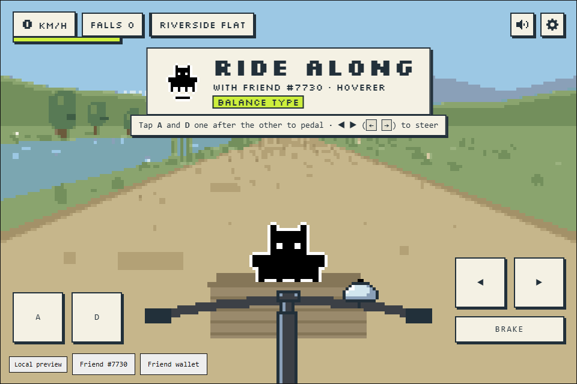
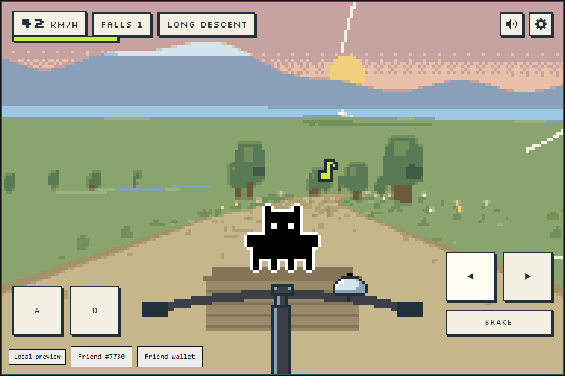
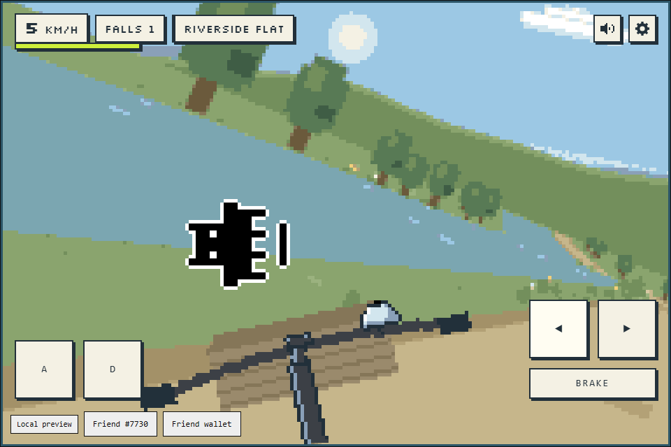
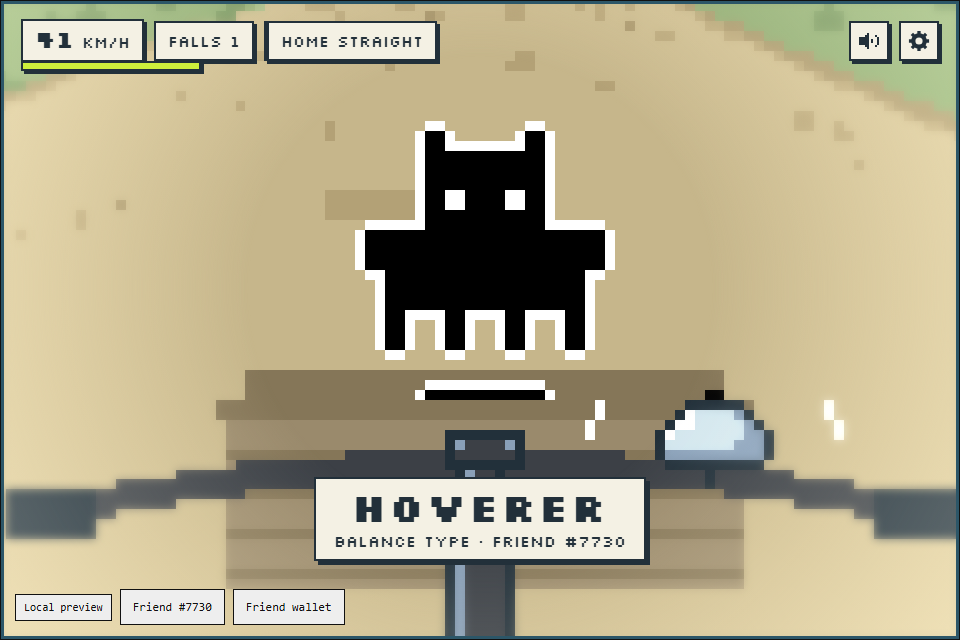
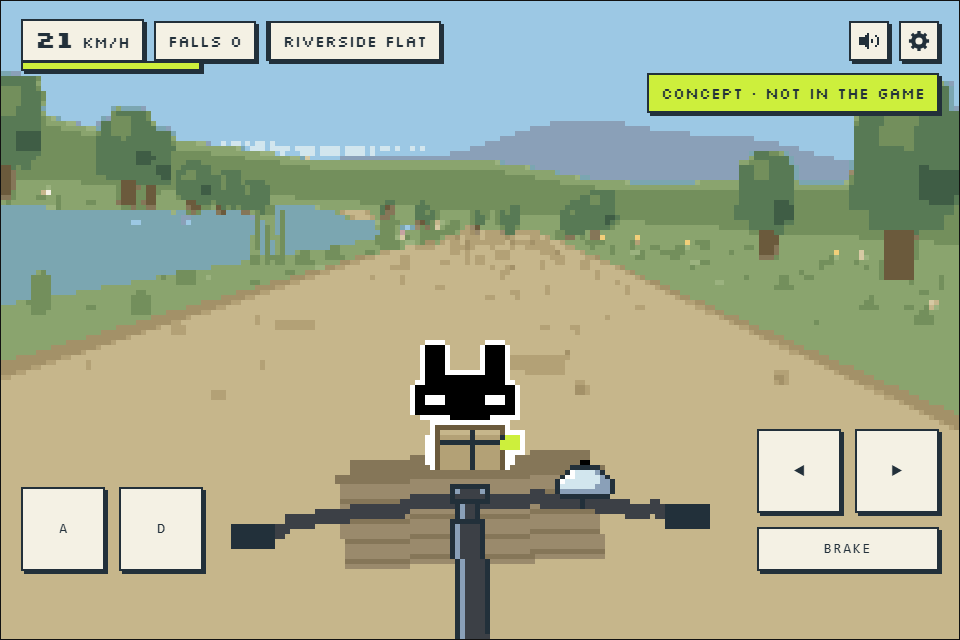

# Ride Along

The joy of riding a bicycle, made into a game, with your Rare Friend riding along in the front basket.

**Builder:** hakari · **Contact:** X [@hakariba](https://x.com/hakariba) · **Category:** Character Spotlight (also relevant: Economy Potential, design only) · **SDK:** FriendSDK v0.1.4

[Play the preview](https://hakariba.github.io/friendsdk/) · [Source code](https://github.com/hakariba/friendsdk/tree/2949e6afb80d48917019dc3380f0891c6f03fbf7/games/ride-along) · [Game README](https://github.com/hakariba/friendsdk/blob/2949e6afb80d48917019dc3380f0891c6f03fbf7/games/ride-along/README.md)

| | |
| --- | --- |
|  |  |
|  |  |

## What it is

Ride Along turns the simple joy of riding a bicycle into a game. At first the bicycle wobbles and you fall; after a few rides it feels easy. Climbs are hard work, and the descents pay you back with pure speed. You pedal by alternating two keys, keep the bicycle upright yourself and steer along a course of just under 900 m: a riverside start, a braking descent with two hairpins, a bridge over the stream, a climb to the summit and a long fast descent to the finish.

Your selected Friend sits in the basket facing you, in its original artwork, and reacts to the ride: it blinks, hums a tune while you ride well, glances at the side you are about to fall to, looks down the road when you cruise, hops for joy when you pick up speed, is thrown out when you fall and climbs back in (shaking itself dry after the river, and wearing a plaster after its third fall). Balance-type Friends lean against the wobble to help; Power-type Friends brace themselves on climbs. At the finish, time slows, the view closes in on your Friend with a name plate, and a card shows your time and rank.

It is a game about enjoying the ride itself. But getting from place to place is also how an economy grows, and a slow, analog trip by bicycle could become part of the Rare Friends world. The ideas are sketched under Future ideas below.

## How it uses Rare Friends

You ride with your own Generations NFT, selected through the SDK's wallet and Friend selection and drawn from the canonical SDK sprites. Each Friend rides a little differently: its family sets a type (Power, Balance or All-round), its id shifts the balance slightly, and older generations get a small bonus read from the Generations contract. The finish line is marked by a floating $RAREFRIENDS-style coin with your own Friend on it.

## Run it

Hosted preview: https://hakariba.github.io/friendsdk/. You need a browser wallet holding a hardwired Generations NFT (generation 1 or higher) on Robinhood mainnet (4663). No RF funding or transaction signature is needed.

To run it locally with Node.js 22+ (the SDK's supported path is Linux or Ubuntu/WSL2; the builder also runs it natively on Windows 11 with Node 24):

```sh
git clone https://github.com/hakariba/friendsdk.git
cd friendsdk
git checkout 2949e6afb80d48917019dc3380f0891c6f03fbf7
npm ci
npm run build
npm run dev:game -- games/ride-along
```

Open the printed URL, connect your wallet and select your Friend. The SDK verifies ownership before play.

## Play

| | Keyboard | Touch |
| --- | --- | --- |
| Pedal | `A` and `D`, alternating | The A and D pads, bottom left |
| Steer | `←` `→` (held) | The arrow pads, bottom right |
| Brake | `↓` or `Space` (held) | The BRAKE pad |

Faster is steadier but turns wider; slower is twitchy and you can fall. Leaning past the limit, leaving the path, riding off the bridge or into the river makes you fall and restart a short way back. Steady pedalling (up to about 3.5 strokes a second) keeps your stamina; mashing drains it. The time runs from your first stroke to the finish. Ranks: Bronze within 3:10, Silver within 2:40, Gold within 2:25, and a Builder coin for beating the builder's best (2:03.1). **Copy for X** copies a one-line result to paste into a post. Settings include mute, reduced motion and restart. Everything stays inside the SDK's 960 × 640 container.

## Costs and rewards

**No economy is used.** The game spends no RF, sells nothing and gives no rewards. The chance-game definition in `game.json` is the placeholder the SDK requires; the game never calls buy, play, settle or redeem. It calls `client.read()` only to initialise the runtime.

## Future ideas (not implemented)

A transaction can move anything instantly. A bicycle is slow and analog, and that is the charm: it turns moving something into a trip, a visit, a story. None of the following is in the game, and each would need its own contracts and persistence.



*Concept mockup, not in the game: the game's own renderer with a parcel added.*

- **Riding the lands.** Each Friend has a land type on chain (Garden, Coastal, Mineral and so on). If lands become places you can visit, you could ride through your Friend's land and along the roads between lands, on courses shaped by each land type.
- **Deliveries as visits.** Carrying a parcel to another Friend's land is less about moving goods than about meeting: the ride itself is the gift. A thank-you tip in $RAREFRIENDS could go to the rider. Cargo would suit Friend types: heavy crystals for Power, fragile goods for Balance, fresh fish against the clock for All-round.
- **Mystery parcels where the ride counts.** Buy a parcel with RF and carry it to the finish. The SDK chance game decides what is inside, and your ride decides how it arrives: a clean ride without a fall could open a better tier, while a fall can break fragile contents. Ride results would be verified before they count, for example by replaying the recorded inputs.
- **Friends along the road.** Other players' Friends could live by the roadside: waving from the grass as you ride past, with your Friend waving back from the basket. The SDK can already read any Friend's artwork; who appears could come from the lands you ride through or from Friends who rode the course recently.
- **Happiness from riding.** The Rare Friends site now shows a Happiness gauge for each Friend. Riding together could raise it: a clean ride without a fall, a new best, or simply a daily ride. FriendSDK v0.1.4 has no API for Happiness, so this would need platform support.
- **Parts packs.** Spend RF on bicycle cosmetics (frame colours, baskets, bells) that you keep while unredeemed.

## Checks

- The fork is upstream FriendSDK v0.1.4 (`ca3bf18`) with only `games/ride-along/`, the typecheck config `games/tsconfig.json` and `games/styles.d.ts` added: `npm ci` and `npm run build` pass. (The game was built on v0.1.2 and moved to v0.1.4 on 2026-09-30, when the default public RPC began limiting history queries and v0.1.2 could no longer find owned Friends.)
- `npx tsc -p games/tsconfig.json --noEmit`: pass
- `node scripts/dev-game.mjs check games/ride-along`: valid (754,620-byte build)
- `node scripts/dev-game.mjs build games/ride-along`: pass; the static output also loads under a sub-path, as on GitHub Pages, with no failed requests or console errors
- Automated browser checks with the SDK test harness (mocked wallet): falls, restart, consecutive rides with Ride again, the finish sequence with and without reduced motion, audio, no page errors
- Real-wallet playthrough by the builder on the hosted preview (desktop Chrome): wallet connection, Friend selection and a full ride to the finish in 2:43.0 (on v0.1.2); after the move to v0.1.4, wallet connection and Friend discovery re-checked with a real wallet on the local preview

## Known limitations

- Best times and ranks last only for the page session; the sandbox has no storage.
- Best played on a desktop in landscape. Phones held upright are not recommended, as the layout is not made for them. Touch controls work, but the feel was tuned on a keyboard.
- The slow-motion edge blur needs canvas filters; browsers without them show only the glow.
- If the Generations contract read fails, the Friend rides without its generation bonus.
- No coins, upgrades or bonus stage yet, and only one course so far.
- Instead of background music, your Friend hums while you ride; there are only a few other sounds (the bell, brake, warning beep, hop and fall).

## Credits

Friend sprites are canonical SDK artwork. In the game, the Friend's eyes close for a blink or widen while it is thrown out, and a small white cross-shaped plaster is drawn on its head after three falls; the rest of the artwork is unchanged. Headings and HUD use Silkscreen (SIL Open Font License 1.1), bundled with its licence. All scenery, the bicycle and all sounds are drawn or synthesized in code; there are no other third-party assets. The screenshots were taken in the SDK test harness with its sample Friend #7730. The parcel mockup shows the builder's Friend #95314 as its canonical SDK sprite, unmodified, holding a parcel drawn for the mockup.
