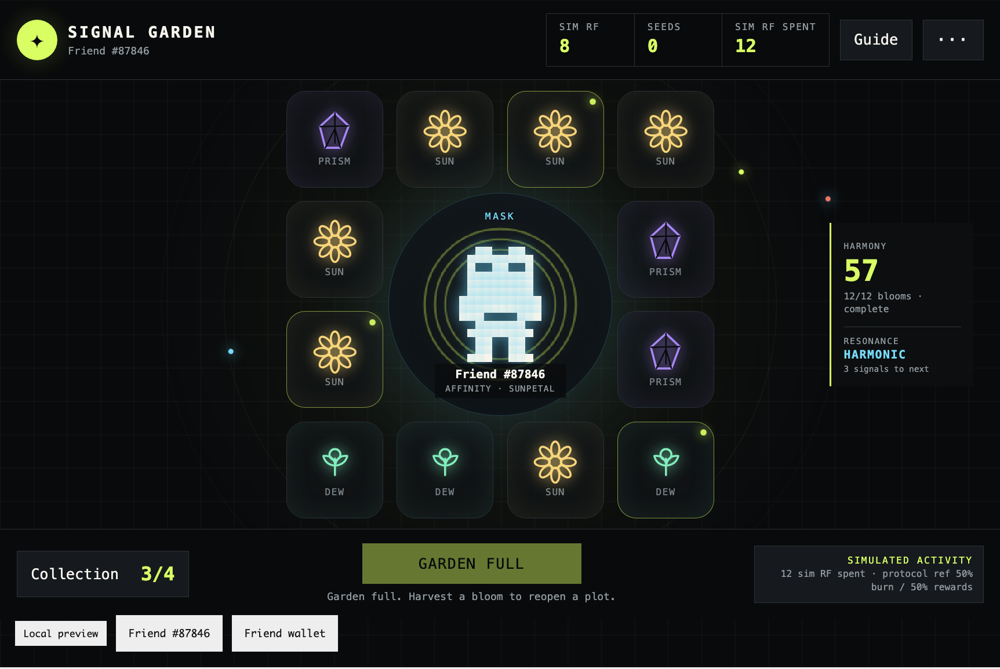

# Signal Garden

> **Judge-safe review path (2026-09-30):** The playable GitHub Pages preview is currently
> triggering an external wallet/security false-positive warning in MetaMask and Brave.
> The current build itself is verified and deployed successfully. Reviewers who do not
> want to bypass that warning can still evaluate the submission from the evidence below:
>
> - **Current source/deploy commit:** `d020a37ee4567eb1d20d9acdcf40a44e45d8d446`
> - **Official FriendSDK baseline:** v0.1.4 / `ca3bf183b809ecf22d87c63d88ce03969a3f8da2`
> - **Final SDK and game checks #100:** SUCCESS
> - **Final Signal Garden preview deploy #75:** SUCCESS
> - **Automated browser flows:** 960 / 760 / 521 / 360 px PASS
> - **JS tests:** 118 pass / 0 fail
> - **Contract tests:** 16 pass / 0 fail / 1 mainnet-fork-dependent skip
> - **Judge-safe static review:** https://raindogkitetu.github.io/friendsdk/judge.html
> - **Playable preview:** https://raindogkitetu.github.io/friendsdk/
> - **Source:** https://github.com/raindogkitetu/friendsdk/tree/main/games/signal-garden
> - **CI:** https://github.com/raindogkitetu/friendsdk/actions/runs/36730191500
> - **Deploy:** https://github.com/raindogkitetu/friendsdk/actions/runs/36730191258
>
> The warning is being tracked as a false-positive with MetaMask and Brave. Signal Garden
> performs no live RF burn, live reward routing or live gameplay transaction.
>
> **Submission note:** the upstream PR description may still show the earlier v0.1.3
> verification snapshot because the current integration cannot edit that upstream PR body.
> This README and the current PR head are the canonical, current v0.1.4 submission.


> **Current economy note:** this README is the canonical current submission. The
> current design uses the Rare Friends **50% burn / 50% rewards** gameplay-payment
> rule only as a clearly labeled protocol reference. Any earlier PR-description
> mention of a 10% burn / 5% seasonal-vault prototype is superseded by this README.


*Screenshot generated by the automated FriendSDK test fixture. The hosted playable
preview still requires the real wallet, Robinhood network and fresh Friend-ownership gate.*

**Real-wallet public-preview verification (2026-09-21)**



*Desktop Brave + MetaMask public-preview verification with freshly verified Friend
#87846. Twelve Seed purchases filled all twelve plots; HUD shows 8 sim RF remaining
and 12 sim RF spent. Garden Full, Harmony 57, Collection 3/4 and HARMONIC resonance
are visible. The SDK frame's "Local preview" badge is FriendSDK v0.1.2's standard
preview-mode label. The user-provided game-only screenshot is reproduced unchanged.*

- **iPhone + MetaMask in-app browser:** freshly verified Generations Friend #20838;
  touch Seed purchase and planting passed; HUD and receipt matched at 1 sim RF spent,
  1 Seed acquired and 1 signal planted; no transaction or signature prompt appeared.
- **Desktop Brave + MetaMask:** freshly verified Generations Friend #87846; twelve
  consecutive Seed purchases filled all twelve plots; HUD showed 8 sim RF remaining
  and 12 sim RF spent; the receipt matched at 12 Seeds acquired / 12 signals planted
  with separate 6 / 6 sim-RF-equivalent 50% burn / 50% rewards protocol references.
  A later public-preview screenshot from the same Friend shows **Garden Full**,
  **Harmony 57**, **Collection 3/4** and **Resonance HARMONIC** alongside those
  8 / 12 HUD totals.
- The frame's **Local preview** badge is FriendSDK v0.1.2's own label for
  `mode === "preview"`; the hosted GitHub Pages build intentionally retains the
  unmodified official runtime terminology. It does **not** mean the screenshot was
  taken from localhost.

**Project name**

Signal Garden

**One sentence**

Grow a personalized signal garden around your verified Rare Friend, where every
simulated 1 RF seed purchase creates measurable repeat token activity while Friend-specific
traits shape non-financial garden strategy.

**Builder / contact**

raindog_kitetu · X [@raindog_kitetu](https://x.com/raindog_kitetu) · GitHub [@raindogkitetu](https://github.com/raindogkitetu)

**Category**

Economy Potential (also relevant: Token Activity and Character Spotlight)

Economy Potential is the primary category because the public submission is a
wallet-gated **simulation**, not a live RF-burning deployment. Token Activity is a
secondary, auditable signal through cumulative simulated spend and the separately
labeled current-protocol routing reference; no live burn is claimed.

**What did you build?**

A personalized signal garden that grows around the player's verified Rare Friend.
Buy a 1 sim RF Signal Seed, choose one of twelve plots, reveal a bloom, then keep
it for harmony or harvest its fixed sim RF value. The Friend's real on-chain family
and art seed determine its bloom affinity and three signal plots, so the selected
Friend directly affects non-financial garden strategy without changing RF odds.
Affinity and signal layout are each reduced to four gameplay patterns, so different
Friends can legitimately share the same pattern; the submission does not claim a
globally unique board for every NFT.

**How does it use Rare Friends?**

The selected Generations NFT is the center of the game. FriendSDK verifies fresh
ownership before play, and Signal Garden reads the Friend's canonical animation,
family and art seed through public SDK APIs. Its official sprite lives at the center
of the garden; family sets one of four bloom affinities; seed marks three glowing
plots. Those traits affect non-financial harmony only and never alter the published
reward table.

Every simulated Seed purchase is modeled as RF activity; planting consumes the
prepaid seed and does not charge RF a second time. The exact preview has an 85%
expected simulated harvest, but that payout table is separate from production
payment routing.

An in-game Token activity receipt makes the loop measurable: acquired seeds,
signals planted and cumulative simulated RF spent all update from the verified SDK
ledger. **Cumulative simulated RF spend also stays visible in the main HUD, including
the 360 px layout, so Token Activity is visible before opening any menu.** The receipt
also shows a clearly labeled current-protocol reference: the same gross activity
split **50% burn / 50% rewards**, without claiming that either transfer occurred or
that protocol rewards fund the preview's bloom payouts.

For every 10 simulated Signal Seed purchases, the preview payout model has **8.5
sim RF expected bloom harvest**, while the separate current-protocol reference shows
**5 sim-RF-equivalent burn + 5 sim-RF-equivalent rewards** for the same 10 sim RF
gross activity. **These figures are not additive:** the 8.5 value is the preview
player-payout expectation; the 5/5 values illustrate a separate routing rule. Every
possible preview reward remains fully reserved at its published maximum, and no live
transfer occurs.

Repeat planting now also advances two **non-financial session goals** without
changing RF odds or rewards: Bloom discovery remembers which of the four signals
have appeared even after harvest, and Resonance advances at 3, 6, 12 and 15 settled
signals. Both reset with the runtime session.

**Source code**

[Signal Garden source](https://github.com/raindogkitetu/friendsdk/tree/main/games/signal-garden) · FriendSDK v0.1.4

**Playable demo / how to run**

[https://raindogkitetu.github.io/friendsdk/](https://raindogkitetu.github.io/friendsdk/)

> **Security-warning review note (2026-09-29):** MetaMask and Brave currently show a
> malicious/phishing warning for this GitHub Pages preview. The deployed
> `SOURCE_COMMIT.txt` matches tested source commit
> `d020a37ee4567eb1d20d9acdcf40a44e45d8d446`; the v0.1.4 build, full browser suite
> and Signal Garden checks all pass. A MetaMask blocklist-removal review is open at
> [MetaMask/eth-phishing-detect #298279](https://github.com/MetaMask/eth-phishing-detect/issues/298279),
> and a false-positive review was also submitted to Blockaid. The Brave warning is tracked in [brave/brave-browser #59436](https://github.com/brave/brave-browser/issues/59436). Reviewers
> who do not wish to bypass a wallet warning can use the real-wallet verification
> screenshot above together with the public source and CI evidence below. No live RF
> burn, live reward routing or live gameplay transaction is performed by this preview.

The hosted preview requires a browser wallet on Robinhood mainnet (chain 4663)
holding a hardwired Generations NFT, generation 1 or higher. The SDK freshly verifies
ownership before mounting the game. Preview balances and results are simulated; no
RF funding, private key or transaction signature is required.

To run locally with Node.js 22+ on Linux or Ubuntu/WSL2:

```sh
git clone https://github.com/raindogkitetu/friendsdk.git
cd friendsdk
npm ci
npm run build
npm run dev:game -- games/signal-garden
```

**How do you play?**

1. Connect a wallet and choose an eligible Friend.
2. Choose **Buy a seed · 1 sim RF** and confirm the simulated action.
3. Choose an empty plot. Planting consumes one seed and reveals one bloom.
4. Keep it for harmony or harvest its fixed simulated RF value.
5. Fill twelve plots, or harvest blooms to reopen space and continue.
6. Open **Simulated activity** (or **Guide → View activity receipt** on a narrow
   screen) to inspect cumulative RF activity and the current 50/50 protocol reference.
7. On narrow screens, **Guide → View collection** keeps Bloom discovery reachable
   even when the compact dock hides the Collection button.

Mouse, touch and keyboard navigation work. The game is silent by design and includes
a reduced-motion setting. Preview currency is labeled **sim RF**. Interrupted
settlement is recoverable through **Resume signal** without purchasing or consuming
a second seed; while the game frame stays mounted, the recovered result is locked
to the plot the player originally selected and cannot be moved to another plot.

**Costs and rewards**

Everything is simulated and labeled.

| Result | Chance | Fixed harvest | Base harmony |
| --- | ---: | ---: | ---: |
| Dewbud | 50% / 5,000 bps | 0.4 sim RF | 1 |
| Sunpetal | 30% / 3,000 bps | 1 sim RF | 2 |
| Prismvine | 15% / 1,500 bps | 1.5 sim RF | 4 |
| Starbloom | 5% / 500 bps | 2.5 sim RF | 8 |

- Seed price: 1 sim RF.
- Expected harvest: exactly 0.85 sim RF / 85%.
- Maximum harvest and reserve per seed: 2.5 sim RF.
- SDK preview prize stake: 25 sim RF (10× the maximum prize).
- One seed produces exactly one bloom.
- Kept blooms retain their fixed simulated liability with no expiry during the
  runtime session.
- Harmony has no RF value. Family-affinity and signal-plot bonuses do not alter odds.

**Production-economy potential**

Signal Garden separates three things that could otherwise be confused:

1. **Gross simulated activity.** Each Seed purchase adds exactly 1 sim RF to the
   cumulative activity counter. Planting consumes that prepaid Seed and does not
   charge a second time.
2. **Preview payout table.** Bloom harvests have a fixed, fully disclosed 85% expected
   simulated value with a 2.5 sim RF maximum, backed by the SDK preview stake.
3. **Current protocol reference.** Rare Friends' current
   [$RAREFRIENDS documentation](https://rarefriends.com/docs/rarefriends) describes
   general gameplay payments as **50% burn / 50% rewards**. The receipt shows that
   50/50 reference separately from the preview payout table.

The receipt tracks gross Seed purchases, not net wallet movement, so harvesting to
reopen space and repurchasing makes repeat simulated RF usage auditable rather than
erasing prior activity.

FriendSDK v0.1.4 does not expose burn/reward-routing, persistence or additional-item
actions. The preview therefore performs **no live burn and no live reward routing**.
The protocol reward half is not claimed to fund player bloom payouts. The 85% preview
return is not a drop-in production payout table: even if the entire current 0.5 RF
rewards half of a 1 RF gameplay payment were hypothetically available for this
game's player payouts, 0.85 RF expected payout would still leave a **0.35 RF expected
gap per Seed**. This submission does not assume that reward half is available.

A live version must either pre-fund a separate reserve/subsidy that covers its chosen
expected payout plus every maximum-prize liability, or reprice/reweight the live
reward table to fit the then-current protocol allocation. Sales must stop before the
reserve cannot fully back the next maximum prize. Explicit wallet confirmations,
published rules and production review remain required.

**Potential paired-asset path — not implemented:** the Vibeathon describes future
token economies that can introduce a separate asset and pair it with $RAREFRIENDS.
A reviewed season could make persistent Bloom or habitat assets a separate layer:
RF gameplay payments would still follow then-current protocol routing; asset issuance,
the RF market pair and any creator/trading-fee rules would require their own published
contract and audit; and any redeemable player payout would stay separately funded.
This submission does **not** deploy, mint, pair or trade such an asset.

This entry contains no live contract or transaction flow.

**What have you tested?**

Automated verification re-run on 2026-09-30 with FriendSDK v0.1.4 in the Node.js 22 deployment/CI environment:

- SDK build: pass.
- Official v0.1.4 protected-runtime integrity diff against `ca3bf183b809ecf22d87c63d88ce03969a3f8da2`: pass.
- SDK JavaScript tests: 118 pass, 0 fail, 0 skipped.
- Contract tests: 16 pass, 0 fail, 1 mainnet-fork-dependent skip.
- Typecheck and full SDK browser suite: pass.
- `friendsdk check`: pass; weights 10,000 bps, expected reward 0.85 sim RF, maximum
  reward 2.5 sim RF.
- SDK-ledger bankroll stress test: pass. The same `game.json` is parsed through
  FriendSDK and the actual preview ledger follows the real 12-slot garden order:
  keep the first twelve blooms, then harvest one before each of signals 13–15 to
  reopen a slot. Fifteen 2.5 sim RF results still leave 2.5 sim RF of free prize
  stake; fifteen 0.4 sim RF results still leave the player 6.2 sim RF from the
  20 sim RF starting balance while twelve 0.4 sim RF blooms remain kept.
- Focused browser flow at 960, 760, 521 and 360 px: pass. The deterministic 960 px
  run exercises all four bloom outcomes, reaches 4/4 Bloom discovery, fills all
  twelve plots, verifies the full-garden purchase block, harvests to reopen space,
  and reaches the 15-signal EVERGREEN tier.
- The browser flow covers verified runtime startup, canonical artwork, visible
  keyboard focus/activation, real touch Seed purchase and planting, accessible
  button/canvas labeling, buy,
  confirmation, interrupted-settlement recovery with plot locking, same-tick
  double-click protection, post-action state-read retry and verified-refresh
  blocking, visible non-blocking phone-width action errors, responsive breakpoints,
  reveal, keep, inspect, harvest,
  cumulative token-activity accounting, Bloom discovery, Resonance, reduced motion,
  24 px minimum game touch targets, accessible plot grouping and viewport bounds.
- Child-frame reload recovery for kept inventory and an already-paid pending play:
  pass.
- Initial canonical-artwork RPC failure → visible in-game Retry → successful recovery while the parent SDK runtime remains ready: pass.
- Source/docs/browser/ledger consistency audit: pass.
- Browser console, sandbox and unexpected-signing checks: pass.
- The v0.1.4 public preview was rebuilt and published by GitHub Actions on 2026-09-30 from source commit `d020a37ee4567eb1d20d9acdcf40a44e45d8d446`. The manual real-wallet checks below are retained from 2026-09-21 on the prior v0.1.2 build and are not relabeled as v0.1.4 manual verification.
- Manual public-deployment check on 2026-09-21: pass on an iPhone running
  iOS 26.7 in the MetaMask mobile in-app browser, using freshly verified
  Generations Friend #20838. A 1 sim RF Seed purchase and touch placement
  completed successfully; the HUD and Token activity receipt agreed on
  1 sim RF spent, 1 Seed acquired and 1 signal planted. No live transaction
  or signature prompt appeared.
- A second manual public-deployment check on 2026-09-21 passed in desktop
  Brave with the MetaMask extension and freshly verified Generations Friend
  #87846. Twelve consecutive Seed purchases filled all twelve plots; the HUD
  showed 12 sim RF spent and the Token activity receipt matched with 12 Seeds
  acquired, 12 signals planted and separate 6 / 6 sim-RF-equivalent protocol
  reference values for the 50% burn / 50% rewards split.

The automated browser fixture is read-only and exists only in tests. Public builds
retain the real wallet and ownership gate. The hosted preview publishes
[`SOURCE_COMMIT.txt`](https://raindogkitetu.github.io/friendsdk/SOURCE_COMMIT.txt)
so the deployed build can be traced back to the exact source commit.

The fork keeps FriendSDK v0.1.4 runtime/package/contracts/assets and runtime build
helpers unchanged from official release commit `ca3bf183b809ecf22d87c63d88ce03969a3f8da2`. CI and deployment
both run a direct protected-path diff against that commit before proceeding. The
preview deployment also runs on every `main` push and allowlists its complete
published file set before pushing, so `SOURCE_COMMIT.txt` cannot silently lag main.
Modified official test/workflow files carry fork-modification comments. The public
preview ships the Apache LICENSE, FriendSDK NOTICE, Signal Garden NOTICE and retained
bundle dependency-license comments.

**Known limitations and wallet/fund risks**

- All RF activity is simulated. The displayed 50% burn / 50% rewards values are
  current-protocol reference values only; no live burn or reward routing occurs.
- Garden placement is session-local because the SDK has no persistence API.
  Pending recovery preserves the intended plot while the current game frame stays
  mounted. If that frame reloads, a recovered pending signal must be assigned to an
  empty plot again; kept blooms rebuild from host inventory without their old plots.
  Because harmony has plot-specific non-financial bonuses, that reconstructed harmony
  score may also differ after a child-frame reload. A full runtime reload resets the
  preview. On iOS, backgrounding a wallet's in-app browser can cause that full
  runtime reload, so the wallet tab should remain foregrounded during a preview
  session.
- Trading, swaps, creator fees, wearables, additional currencies and live upgrades
  are not implemented.
- Connecting reads wallet identity and owned Friends. The game has no signer,
  arbitrary calldata, private-key access, deployment or bankroll withdrawal power.
- Official Rare Friends production publication requires separate review.

**Credits**

Built with FriendSDK v0.1.4 (Apache-2.0 source license and repository artwork
notice): runtime, wallet/Friend verification, canonical Generations art reader,
sandbox bridge and simulated ledger. Signal Garden's UI, bloom vectors, rules,
scoring and economy model are original. No external assets beyond the credited
FriendSDK / Rare Friends artwork are used.
