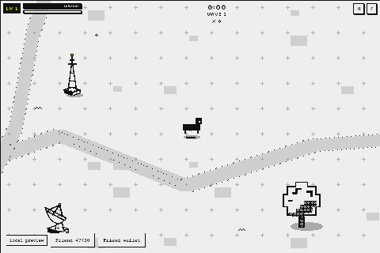

# Stay Rare

**Builder:** afuro · GitHub [@afurourrego](https://github.com/afurourrego) · X [@afurourrego](https://x.com/afurourrego)
**Category:** Character Spotlight · **SDK:** FriendSDK v0.1.2

## What did you build?
A survivor-like starring your Rare Friend in the rarefriends.com 1-bit style. Move, your weapons fire on their own,
survive endless waves of glitches (real Generations Friends corrupted by static, with red eyes) and a rotating boss
every ~90 seconds, and level up through a gacha "Level up!" terminal that decodes 3 power chips.

## How does it use Rare Friends?
- **Your Friend is the hero**, drawn from its canonical on-chain sprite.
- **Its family decides its starting weapon and trait:** Skeleton: Bone Bolt, +10% damage · Mask: Mask Wave, −7%
  cooldown · Family: Kin Orbit, +35% XP · Cellular: Split Cell, regenerates 0.2 HP/s · Asymmetry: Offset Shot, +10% crit ·
  Hoverer: Drift Mines, +20% speed · Colossus: Quake Stamp, +40% HP, −10% speed · Sparkling: Glitter Bounce, +10% area ·
  Hollow: Void Beam, 1 s invulnerability after a hit.
- **Your own Friend plays differently from every other one:** three traits are read from its own on-chain pixels and
  shown on the title card. Bulk (pixel count): tougher but slower, or quick but fragile. Symmetry: more crits, or faster
  weapons if lopsided. Eyes: bigger eyes pick up gems from farther away. They are small trade-offs, so no Friend is broken.
- **The glitches are real Generations Friends** corrupted by static, with red eyes, and the final boss, The Corruptor, is
  your own Friend inverted.
- **The map is built from FriendSDK props** (trees, rocks, crates, terminals…) with collision and depth: you walk behind
  and in front of them, shots stop on them, and crates and terminals break, sometimes dropping a health patch.
- **Before you connect,** the SDK's own wallet screen is styled as the title screen (host.css only): a live loop of real
  gameplay, the pixel logo, and the runtime's menus in the same 1-bit terminal look. Chiptune music changes when a boss
  arrives.

## What would be on-chain?
FriendSDK v0.1.2 adds the whole price to the game stake and has no pool, payout, burn or persistence API. To go live:
a pool/burn contract with daily payouts, server-side score verification (the simulation is deterministic; seed +
recorded inputs replay the exact score), and legal review of a paid-entry tournament. Scores and the pool reset on
reload today.

## How does it use randomness?
- **The chest (RF):** the SDK's chance-game draw at `settle(playId)` decides Pool entry (99%) or Free run (1%), independent
  of the score. The pixel-art opening only presents the result the SDK already chose.
- **The run (game only, never RF):** each run gets a seed from `crypto.getRandomValues`; the whole simulation (spawns,
  level-up chips common 70% · rare 25% · legendary 5%, crits, health-patch drops) runs on a seeded RNG at a fixed 60 Hz
  step, so seed + recorded inputs replay the exact score.

## Source code
https://github.com/afurourrego/stay-rare/tree/08e92c7c2272240bb30f5404adfba2e261450b35 (FriendSDK v0.1.2, game in `games/stay-rare/`)

## Playable demo
https://afurourrego.github.io/stay-rare/ — requires a browser wallet on Robinhood mainnet (4663) with a hardwired
Generations NFT (gen ≥ 1). Connecting only reads: no signatures, no transactions, no RF. Don't want to connect? The GIF
above shows the opening of a run (recorded with the SDK's automated test fixture, sample Friend #7730).

## How do you play?
WASD / arrows or drag to move; weapons auto-fire. Each level opens the "Level up!" terminal: 3 power chips with rarity
(common 70% · rare 25% · legendary 5%), pick one. Max a weapon and own its paired passive to evolve it (e.g. Bone Bolt +
Sharp Edge = Bone Storm). Four bosses rotate, ending with The Corruptor, a corrupted copy of your own Friend; beating
one heals you and levels you up. Break crates and terminals for health patches. P / Esc or [ II ] pauses; M mutes;
"Reduce motion" is in the pause menu. Score = bosses defeated, then time survived. On death the chest opens in the
Run over terminal.

## Costs and rewards (all simulated)
| Consumable | Price | Outcome | Chance | Reward |
|---|---|---|---|---|
| Run | 1 RF | Pool entry | 99% | 0 RF |
| | | Free run | 1% | 1 RF (redeemable, no expiry) |

Expected reward 0.01 RF per run; each Run reserves its 1 RF max prize; the chest roll is independent of score.
**Design split of each 1 RF:** 0.89 Daily Pool · 0.01 free-run chest · 0.05 house · 0.05 burned. The Daily Pool
(best run per Friend, top 10 share 30/20/13/9/7/6/5/4/3/3 %, cutoff 00:00 UTC) is shown in-game with example rivals.

## What have you tested?
209 unit tests (simulation, determinism replay, Friend traits, scenery and breakables, weapons, bosses, chest
timeline, music sequencer, economy with `createGamePreview`), TypeScript typecheck, a headless bot balance suite
(120 seeds × 9 families: an idle Friend dies before the first boss, also with the most extreme traits; a fleeing one
beats it in ≥ 90% of runs; every family within ±25% of the median), `friendsdk check`, and `friendsdk test` in a
browser at 960 px and 360 px. Real-wallet playtest: DONE (2026-09-25, published Pages demo, Robinhood mainnet, owned hardwired Generations Friend).

## Known limitations
- Scores, the session's best run and the Daily Pool reset on reload (the SDK sandbox has no storage).
- The Daily Pool, payouts, house and burn are simulated with example rivals; FriendSDK v0.1.2 has no API for them.
- Playing, even the preview, needs a real wallet with an eligible Friend (SDK rule); the GIF above shows gameplay for
  anyone who prefers not to connect.
- Scores are not verified server-side yet (the replay makes that possible later).
- Below 480 px wide the pixel art scales down smoothly instead of by whole multiples.

## Credits
FriendSDK artwork, props, runtime and sound kit (Apache-2.0, NOTICE.md); glitch enemies are real Generations Friends
decoded with the SDK. Action sounds and the two background tracks (wave and boss) are chiptune synthesized in code. Fonts Silkscreen and Archivo (OFL). Built with
Claude Code.
