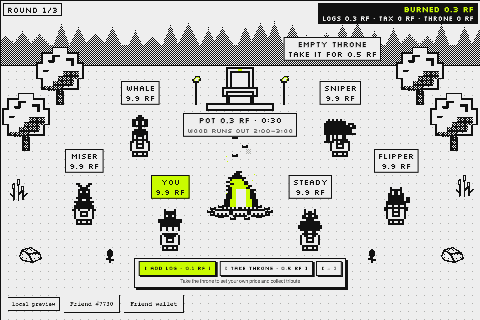

# Throne & Flame

**Builder:** afuro · GitHub [@afurourrego](https://github.com/afurourrego) · X [@afurourrego](https://x.com/afurourrego)
**Category:** Token Activity · **SDK:** FriendSDK v0.1.2

## What did you build?
A real-time strategy game where $RAREFRIENDS burns continuously, not only at the entry. You and five Friends play a
3-round season around a **bonfire** and a **Harberger-tax throne**:

- **The fire (everyone's game):** a log costs 0.1 RF. 40% burns, 50% feeds the pot and 10% pays the king. The last
  log before the fire dies takes the pot. The fire holds less time as the round goes on, and the wood runs out at a
  hidden moment between 2:00 and 3:00, so nobody can snipe the last tick.
- **The throne (the strategy):** the king declares their own price and pays 1% of it every 10 s as tax, all burned.
  Anyone can buy the throne at that price: the old king gets 95% and 5% burns. The king collects the tribute of every
  log. A low price is cheap to hold but easy to lose; a high price is harder to take but burns a lot, and no price is safe. The throne is not refunded
  at the end of the season, so the last round becomes a hot potato.

## How does it use Rare Friends?
- **Your Friend is your seat** at the fire, drawn from its canonical on-chain sprite. It sits on the throne with a
  pixel crown when you are king.
- **The other five seats are real Generations Friends**, decoded with the SDK and drawn canonical. Each one plays a
  personality: Miser, Whale, Sniper, Steady and Flipper.
- **The scene is a forest clearing built with official FriendSDK props** (trees, rocks, flowers, reeds), drawn in true
  1-bit. Every Friend faces the fire from the front, sitting on a log stump.
- **The clearing darkens each round:** day, dusk, then night with stars and fireflies. The firelight shrinks as the fire
  dies, so the last seconds of a round get visibly darker.
- **Bots vs real players:** FriendSDK has no online multiplayer, so the demo fills the other five seats with bots.
  In production all six seats are real players on a contract.
- **Before you connect,** the SDK's own wallet screen is styled as the title screen (host.css only): a live loop of a
  real season, the pixel logo, and the runtime's menus in a 1-bit terminal look.

## How does it spend and burn $RAREFRIENDS?
- **Four burn sources, all continuous:**
  - 40% of every log, plus its 10% tribute when the throne is empty;
  - the king's tax, 0.01% of the declared price every 0.1 s (1% every 10 s), charged per tick so it can't be dodged by
    dropping the price before a payday;
  - 5% of every takeover, or all 0.5 RF when someone takes an empty throne;
  - a pot nobody claims in the last round.
- **An opening log from everyone** starts each round, so standing still is never free.
- **A big BURNED counter** is always on screen, split by source. The results show what you burned yourself and what
  the whole table burned.
- **Measured:** a headless balance suite plays 120 seasons per scripted strategy against the bots. A season burns
  16–30% of the 60 RF on the table (median by strategy), in about 7.5 minutes.
- **Exact accounting:** RF amounts are bigint base units. Balances + pot + burned = 60 RF on every tick, which is
  tested over 120 full seasons.

## What would be on-chain?
FriendSDK v0.1.2 supports one consumable and one outcome table and has no burn, transfer or multiplayer API, so the
season runs on an in-game simulated ledger. To go live:
- a contract where logs, tax and takeovers are on-chain transfers and burns;
- the pot paid out when the fire dies;
- the hidden wood limit from a commit-reveal or VRF;
- six real players per table.

Balances and results reset on reload today.

## How does it use randomness?
- **The ticket (RF):** the SDK's chance-game draw at `settle(playId)` decides Season (99%) or Rekindle (1%: the 10 RF
  ticket comes back), independent of how you played.
- **The season (game only, never RF):** each season gets a seed from `crypto.getRandomValues`. A seeded RNG at a fixed
  10 Hz step decides the bots' decisions and human-like reaction times (0.4–1.5 s), the hidden wood limit, and the
  order of actions landing in the same tick. Same seed + same actions → same season (tested).

## Source code
https://github.com/afurourrego/throne-flame/tree/e5404ed243c264e0b7776d949dc81fa16bb19e6b (FriendSDK v0.1.2, game in `games/throne-flame/`)

## Playable demo
https://afurourrego.github.io/throne-flame/

- **Requirements:** a browser wallet on Robinhood mainnet (4663) with a hardwired Generations NFT (gen ≥ 1).
  Connecting only reads: no signatures, no transactions, no RF.
- **Don't want to connect?** The GIF above shows a round in play. It was recorded with the SDK's automated test
  fixture, sample Friend #7730.

**Run it locally:** Node ≥ 22, then `npm ci && npm run dev` in the repo (same real-wallet gate), or `npm run build`
for the static preview in `games/throne-flame/.friendsdk/`.

## How do you play?
- **Add log** (Space, 0.1 RF, one per second).
- **Take throne** (T). As king, ← / → set your price; the action bar shows your tax and tribute per minute.
- **Menu:** P / Esc or ≡ opens it (pause, sound, reduce motion, rules, leave season). M mutes.
- **Season:** 3 rounds, about 6–8 minutes, ranked by net profit.

## Costs and rewards (all simulated)
| Consumable | Price | Outcome | Chance | Reward |
|---|---|---|---|---|
| Season | 10 RF | Season | 99% | 0 RF |
| | | Rekindle | 1% | 10 RF (redeemable, no expiry) |

- **Expected reward:** 0.1 RF per ticket.
- **Reserve:** each Season reserves its 10 RF max prize.
- **Preview session:** 20 simulated RF, which covers 2 seasons.
- **Inside a season:** the 10 RF ticket becomes your season bag, and every log, tax tick and takeover moves or burns
  it on the in-game ledger.

### Checked with RF Economy Lab
We ran `game.json` through our Economy Potential entry,
[RF Economy Lab](https://afurourrego.github.io/rf-economy-lab/), using its own functions: FriendSDK's
`expectedReward` / `maximumPrize` and its seeded bankroll simulation (1,000 runs × 10,000 plays, seed 1).

| Term | Value |
|---|---|
| Expected reward per ticket | 0.1 RF (RTP 1%) |
| Max prize reserved per play | 10 RF |
| Stake for ≤ 1% pause risk | 10 RF (sales never pause) |

**About the "99% house edge":** that figure is an SDK artifact. In the SDK ledger the 10 RF ticket goes to the game's
bankroll, because FriendSDK v0.1.2 can't hand the season bag back. In the design, those 10 RF are your stake at the
table: you play them against the other seats, and only what the fire, the tax and the takeovers burn is gone.

**Burn projection (Lab sinks, design only):** 1,000 players × 1 season with a 10 RF bag each burn **1,660 RF** at a
quiet table (16.6%, idle median) to **2,670 RF** at a busy one (26.7%, throne fights), measured by our balance suite.

## What have you tested?
- **Unit tests (88):**
  - the ledger and its invariant;
  - fire, cap and hidden wood;
  - throne takeovers, price changes and tax;
  - bots and their reaction times;
  - rounds, leave and skip;
  - determinism;
  - HUD, input and effects;
  - the scene: front-facing bot art, day → dusk → night, firelight, smoke and props placement;
  - economy with `createGamePreview`.
- **TypeScript typecheck.**
- **Headless balance suite (6 checks):** 120 seeds × 7 scripted strategies (idle, spam, sniper, late spam, cheap
  king, whale king, and a "locked king" that holds the throne above every bot's usual limit), each with a 0.3 s
  human reaction.
  - No strategy wins more than 40% of seasons or has a median profit above +2 RF.
  - Standing still wins about 2% of seasons.
  - Every season burns 10–45% of the table.
- **`friendsdk check`.**
- **`friendsdk test` in a browser at 960 px and 360 px:**
  - one log per Space press;
  - take the throne and raise the price;
  - leave the season and settle the ticket;
  - no console errors.

Real-wallet playtest: DONE (2026-09-25, published Pages demo, Robinhood mainnet, owned hardwired Generations Friend).

## Known limitations
- The other five seats are bots (no online multiplayer in the SDK). Winnings stay in the simulated ledger.
- Balances and results reset on reload (the SDK sandbox has no storage).
- Playing, even the preview, needs a real wallet with an eligible Friend (SDK rule). The GIF shows gameplay for anyone
  who prefers not to connect.
- On phones the scene shows at 1× and is cropped at the sides, to keep the pixel art sharp.

## Credits
- **Artwork, runtime and sound kit:** FriendSDK (Apache-2.0, NOTICE.md). The bots are real Generations Friends decoded
  with the SDK.
- **Sounds and music:** chiptune synthesized in code.
- **Fonts:** Silkscreen and Archivo (OFL).

Built with Claude Code.
